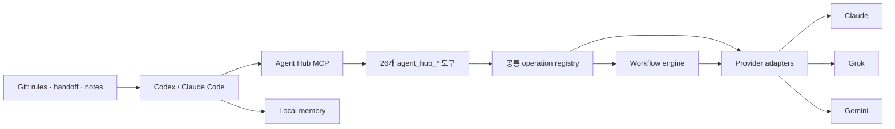

# Agent Hub

Claude, Grok, Gemini를 하나의 MCP 서버에서 사용하는 개인용 멀티모델 작업 환경입니다.

AI 클라이언트에는 `agent-hub-mcp` 하나만 연결합니다. 단순한 작업은 원하는 모델에 바로 맡기고, 긴 작업은
여러 모델이 조사·작성·검증을 나눠 맡는 workflow로 실행할 수 있습니다. 규칙과 작업 기록은 특정 AI 앱에
묶이지 않도록 Git과 로컬 파일에 보관합니다.

> Agent Hub는 Anthropic, xAI, Google의 공식 제품이 아닙니다. 각 서비스의 계정, 구독, 사용 정책과
> 사용량 제한은 직접 확인해야 합니다.

## 한눈에 보기

- MCP 서버 1개: `agent-hub-mcp`
- 공개 도구 26개: 모두 `agent_hub_*` 이름과 같은 결과 형식을 사용합니다.
- 모델 3종: Claude, Grok, Google Antigravity 기반 Gemini
- workflow 4개: 저장소 문서, Git 문서, 근거 기반 조사, 멀티모델 README
- 공통 규칙: Ruler 원본에서 `AGENTS.md`, `CLAUDE.md`와 클라이언트 설정을 생성합니다.
- 로컬 메모리: basic-memory의 semantic embedding을 끄고 FTS 검색만 사용합니다.
- 작업 인계: `HANDOFF.md`와 Git으로 다른 AI 클라이언트에서도 이어서 작업할 수 있습니다.

## 구조



외부에서 보이는 API는 `agent_hub_*` 26개뿐입니다. provider별 도구 이름은 workflow와 adapter가 내부에서
사용하지만, 통합 MCP의 `tools/list`나 `tools/call`에는 노출하지 않습니다.

## 지원 범위

| 작업 | Claude | Grok | Gemini | Hub·로컬 |
|---|:---:|:---:|:---:|:---:|
| 대화 | ✓ | ✓ | ✓ |  |
| 상태·모델 목록·로그인 | ✓ | ✓ | ✓ |  |
| 이미지·프레임 분석 | ✓ | ✓ | ✓ | 입력 정규화 |
| 근거가 포함된 검색 | ✓ | ✓ | ✓ | 출처 형식 통합 |
| 초안·번역·윤문·요약 | ✓ | ✓ | ✓ | 공통 prompt와 검증 |
| 이미지 생성 |  | ✓ | ✓ | 로컬 캐시 |
| 모델 비교 | ✓ | ✓ | ✓ | 다중 provider 실행 |
| Git diff 검토 | ✓ | ✓ | ✓ | diff 수집 |
| 릴리스 스냅샷 |  |  |  | ✓ |
| 릴리스 문서 | ✓ | ✓ | ✓ | Git 사실 수집 |
| 모델 설정 | ✓ | ✓ | ✓ | provider별 범위 적용 |
| transport·profile 설정 |  |  | ✓ |  |

이 표는 각 회사 제품 전체의 기능이 아니라 Agent Hub adapter에 구현된 범위를 뜻합니다. 대화·vision·글쓰기·
diff 검토는 현재 로그인 방식으로 사용할 수 있습니다. Claude·Grok의 native 검색과 Grok 이미지 생성은 계정의
API 권한이 필요할 수 있으므로 실제 호출 결과까지 확인해야 합니다.

`agent_hub_chat`은 `provider=claude|grok|gemini`로 모델을 직접 선택할 수 있습니다. `provider=auto`는 전달한
모델 이름을 기준으로 경로를 고르며, 모델을 지정하지 않으면 Claude를 사용합니다. 검색·글쓰기·diff 검토·
릴리스 문서는 세 provider를 선택할 수 있고, 이미지 생성은 Grok과 Gemini를 지원합니다.

## 설치

### 필요한 환경

- Python 3.10 이상
- Node.js와 `npx`: Ruler 규칙 동기화에 사용합니다.
- `uv` 또는 `uvx`: 로컬 공유 메모리를 사용할 때 필요합니다.
- 사용할 provider의 계정, 구독 또는 API 키

모델 연결과 일부 로그인 경로는 macOS에서 검증했습니다. basic-memory를 쓰지 않는다면 `uvx` 없이도 핵심
MCP 서버는 실행할 수 있습니다.

### 1. 저장소 설치

```bash
git clone https://github.com/Meapri/agent-hub.git
cd agent-hub

python3 -m venv .venv
./.venv/bin/pip install -e '.[dev]'
./.venv/bin/pytest -q
```

설치가 끝나면 `.venv/bin/agent-hub-mcp`가 생깁니다. provider별 MCP 실행 파일은 설치하지 않습니다.

### 2. 로컬 경로 설정

[`instructions/.ruler/ruler.toml`](./instructions/.ruler/ruler.toml)의 아래 경로를 실제 clone 위치에 맞게
수정합니다.

- `BASIC_MEMORY_CONFIG_DIR`
- `BASIC_MEMORY_HOME`
- `mcp_servers.agent-hub.command`

설정을 반영하고 생성물이 원본과 일치하는지 확인합니다.

```bash
./scripts/sync.sh
./scripts/check-sync.sh
```

Codex와 Claude Code용 예시는 [`hubs/codex/`](./hubs/codex/)와
[`hubs/claude-code/`](./hubs/claude-code/)에 있습니다. 두 설정 모두 `agent-hub`와 `memory` 서버만 등록합니다.

### 3. Provider 동의

외부 모델을 호출하기 전에 사용할 provider에 명시적으로 동의해야 합니다.

```bash
./.venv/bin/claude-codex-consent grant --i-understand-and-consent
./.venv/bin/grok-codex-consent grant --i-understand-and-consent
./.venv/bin/google-antigravity-consent grant --i-understand-and-consent
```

사용하지 않는 provider에는 동의할 필요가 없습니다. 동의를 취소할 때는 `grant` 대신 `revoke`를 사용합니다.

### 4. 로그인

Claude:

```bash
claude auth login --claudeai
./.venv/bin/python scripts/claude_codex_login.py mirror-keychain
./.venv/bin/python scripts/claude_codex_login.py status
```

Grok:

```bash
./.venv/bin/python scripts/grok_codex_login.py interactive
./.venv/bin/python scripts/grok_codex_login.py status
```

Google Antigravity:

```bash
./.venv/bin/python scripts/google_antigravity_login.py interactive
./.venv/bin/python scripts/google_antigravity_login.py status
```

Claude는 구독 OAuth를 우선 사용하며 `ANTHROPIC_API_KEY`를 대체 경로로 사용할 수 있습니다. Grok은
SuperGrok OAuth를 우선 사용하며 필요하면 `XAI_API_KEY`를 사용할 수 있습니다. Google OAuth 토큰은 로컬
설정 디렉터리에 저장되며 저장소에는 커밋하지 않습니다.

### 5. 설치 확인

```bash
./scripts/doctor.sh
```

`doctor.sh`는 규칙 동기화, Python 패키지, basic-memory, 통합 MCP 실행 파일과 메모리 저장소를 확인합니다.
모델별 동의·로그인·준비 상태는 MCP 연결 후 `agent_hub_status`로 확인합니다.

## 사용 예시

### 원하는 모델에 바로 맡기기

```text
agent_hub_chat에서 provider=claude로 이 설계의 실패 가능성을 검토해줘.
agent_hub_chat에서 provider=grok으로 같은 설계를 다른 관점에서 검토해줘.
agent_hub_chat에서 provider=gemini로 두 의견을 비교해서 정리해줘.
```

```text
agent_hub_search로 이 주제의 최신 공식 자료를 찾아줘.
agent_hub_write로 이 초안을 읽기 쉬운 한국어 기술 문서로 다듬어줘.
agent_hub_review_diff로 현재 저장소 변경 사항에서 버그와 빠진 테스트를 찾아줘.
```

### 이미지나 프레임 분석하기

```text
agent_hub_chat에서 provider=claude로 이 프레임의 쥐 자세와 가려진 관절을 설명해줘.
images에는 프레임 경로를, workspace_root에는 그 파일이 들어 있는 작업 폴더의 절대경로를 넣어줘.
```

같은 요청을 `provider=grok`, `provider=gemini`로 반복하면 프레임별 판단을 교차 검토할 수 있습니다. 로컬 파일은
명시한 `workspace_root` 안에 있어야 하며, JPEG·PNG·GIF·WebP 파일 하나는 20 MiB를 넘을 수 없습니다.

### 여러 provider를 한 번에 비교하기

```text
agent_hub_compare_models에서 providers=["claude", "grok", "gemini"]로 같은 설계를 비교해줘.
```

provider별 응답, 실제 모델, 소요 시간, 사용량, warning을 같은 결과 형식으로 반환합니다. 일부 provider만
실패하면 성공한 결과는 유지하고 `partial_compare_failures` warning을 남깁니다.

### Workflow를 계획한 뒤 단계별로 실행하기

```text
agent_hub_plan_workflow로 repo_document의 readme preset 실행 계획을 보여줘.
project_root는 현재 저장소의 절대경로를 사용해줘.
```

1. `agent_hub_start_workflow`로 실행을 시작합니다.
2. 반환된 다음 작업을 실행합니다.
3. 결과를 `agent_hub_continue_workflow`에 전달합니다.
4. 완료 결과를 `agent_hub_verify`로 다시 확인합니다.

이 방식은 모델별 중간 결과를 직접 확인하고 싶을 때 적합합니다. 실행 상태는 메모리와 로컬 파일 저장소에
보관되므로 MCP 프로세스를 다시 시작한 뒤에도 `agent_hub_get_run`으로 불러올 수 있습니다.

### Workflow를 끝까지 자동 실행하기

```text
agent_hub_run_workflow로 deep_readme를 실행해줘.
project_root는 현재 저장소의 절대경로를 사용하고 max_leaf_calls는 8로 제한해줘.
```

자동 실행도 provider별 동의와 인증 검사를 건너뛰지 않습니다. 여러 모델을 호출할 수 있으므로
`max_leaf_calls`, `per_call_timeout`, `max_tokens`를 작업 규모에 맞게 지정하는 편이 좋습니다.

## 기본 Workflow

| Workflow | Preset | 처리 흐름 |
|---|---|---|
| `repo_document` | `readme` | 저장소 사실 수집 → README 작성 → 검증 |
| `repo_document` | `technical-doc` | 저장소 사실 수집 → 기술 문서 작성 → 검증 |
| `repo_document` | `proposal` | 저장소 사실 수집 → 제안서 작성 → 검증 |
| `git_document` | `pr-description` | Git 변경 수집 → PR 설명 작성 |
| `git_document` | `release-notes` | Git 변경 수집 → 릴리스 노트 작성 |
| `research_brief` | `default` | 근거 검색 → 출처 기반 요약 → 검증 |
| `deep_readme` | `default` | Claude 구조 분석 → Grok 사용성 분석 → Gemini 작성 → 검증 |

번역, 윤문, 요약, 이미지 생성처럼 한 번의 모델 호출로 끝나는 기능은 workflow로 감싸지 않고 직접 도구로
제공합니다.

## 공개 도구 26개

### Provider와 인증

| 도구 | 용도 |
|---|---|
| `agent_hub_status` | 동의, 인증, 준비 상태와 기본 모델 확인 |
| `agent_hub_list_models` | 모델 목록 조회와 선택적 live probe |
| `agent_hub_auth_start` | provider별 로그인 시작 |
| `agent_hub_auth_complete` | 브라우저·device-code 로그인 완료 |
| `agent_hub_auth_refresh` | OAuth 토큰 갱신 또는 검증 |
| `agent_hub_auth_logout` | 로컬 OAuth 정보 삭제 |

### 직접 작업

| 도구 | 용도 |
|---|---|
| `agent_hub_chat` | Claude, Grok, Gemini 대화 |
| `agent_hub_search` | Claude web search, Grok web·X search, Gemini grounding |
| `agent_hub_write` | 선택한 provider로 초안, 번역, 윤문, 재작성, 요약 |
| `agent_hub_generate_image` | Grok·Gemini 이미지 생성과 로컬 캐시 저장 |
| `agent_hub_compare_models` | 같은 입력을 Claude·Grok·Gemini에서 비교 |
| `agent_hub_review_diff` | 로컬 Git diff 수집 후 선택한 provider로 검토 |
| `agent_hub_release_snapshot` | 모델 호출 없이 로컬 릴리스 정보 수집 |
| `agent_hub_release_draft` | 로컬 초안 생성과 선택적 provider 윤문 |

### 설정

| 도구 | 용도 |
|---|---|
| `agent_hub_get_settings` | provider별 기본 모델과 적용 범위 조회 |
| `agent_hub_update_settings` | Claude·Grok 모델 기본값 또는 Gemini 설정 변경 |
| `agent_hub_reset_settings` | provider 일부 또는 전체 설정 초기화 |

### Workflow

| 도구 | 용도 |
|---|---|
| `agent_hub_list_workflows` | workflow와 preset 목록 조회 |
| `agent_hub_get_workflow` | 단계, context policy, binding 설명 |
| `agent_hub_plan_workflow` | 실행하지 않고 구체적인 단계 생성 |
| `agent_hub_start_workflow` | 단계별 실행 시작 |
| `agent_hub_continue_workflow` | 한 단계의 결과를 전달하고 다음 단계 진행 |
| `agent_hub_get_run` | 저장된 실행 상태 조회 |
| `agent_hub_run_workflow` | in-process adapter로 끝까지 자동 실행 |
| `agent_hub_delegate` | capability, context, fallback을 포함한 단일 호출 준비 |
| `agent_hub_verify` | 문서 정책과 저장소 사실을 기준으로 결과 검증 |

## 공통 결과 형식

모든 통합 도구는 MCP의 `content[]`, `isError`, `structuredContent`를 반환합니다. `structuredContent` 안에서는
아래 필드를 공통으로 사용할 수 있습니다.

```json
{
  "success": true,
  "operation": "chat",
  "provider": "gemini",
  "model": "selected-model",
  "text": "result text",
  "finish_reason": "stop",
  "usage": {},
  "warnings": [],
  "error": null,
  "artifacts": [],
  "data": {}
}
```

모델이 출력 한도에 도달하면 잘린 결과를 정상 완료로 처리하지 않습니다. `success=false`와
`incomplete_finish_reason` warning을 확인할 수 있습니다.

## 규칙, 메모리, 작업 인계

| 정보 | 저장 위치 | 역할 |
|---|---|---|
| 공통 AI 규칙 | [`instructions/.ruler/`](./instructions/.ruler/) | 여러 클라이언트에 같은 규칙 배포 |
| 생성된 규칙 | `AGENTS.md`, `CLAUDE.md` | Codex, Claude Code, Gemini, Cursor가 읽는 결과물 |
| 진행 상태 | [`HANDOFF.md`](./HANDOFF.md) | 중단 지점과 다음 작업 기록 |
| 장기 메모리 | [`memory/data/`](./memory/data/) | 결정과 반복해서 피해야 할 실수 기록 |
| 코드와 변경 이력 | Git | 실제 상태의 정본 |

basic-memory는 검색을 돕는 보조 계층입니다. 코드 상태나 현재 진행 상황을 대신하지 않으며, 기본 설정에서는
semantic embedding을 사용하지 않습니다.

## 보안

- 각 provider는 별도의 명시적 동의를 확인합니다.
- adapter 구현 여부와 현재 계정의 native API 권한을 구분합니다.
- OAuth 토큰과 API 키는 사용자 설정 디렉터리, Keychain 또는 환경변수에만 둡니다.
- source file, Git diff, 저장소 사실을 읽는 도구에는 대상 workspace의 절대경로를 명시합니다.
- 홈 디렉터리 전체, 파일시스템 루트, 민감한 인증 경로는 workspace root로 사용할 수 없습니다.
- 자동 workflow와 모델 비교는 여러 번의 외부 호출을 만들 수 있습니다.
- 테스트 성공은 실시간 구독 한도나 모델 응답 품질까지 보장하지 않습니다.

Antigravity의 파일·인증 경계는
[`plugins/antigravity-codex/SECURITY.md`](./plugins/antigravity-codex/SECURITY.md)에 자세히 정리되어 있습니다.

## 이전 이름은 지원하지 않습니다

통합 전 사용하던 `orchestrate_*`, `claude_codex_*`, `grok_codex_*`, `google_antigravity_*` 이름은
`agent-hub-mcp`에 등록되지 않습니다. 호출하면 `unknown tool` 오류가 반환됩니다. 새 설정에서는 반드시
`agent_hub_*` 도구를 사용해야 합니다.

provider 패키지 안의 leaf 구현은 내부 workflow 실행을 위해 남아 있지만 별도 MCP console script로
설치하거나 외부 API로 공개하지 않습니다.

## 저장소 구조

```text
agent-hub/
├── src/agent_hub/                 # 공개 operation registry와 통합 MCP 서버
│   ├── operations.py              # 26개 도구의 schema, handler, 공통 결과 형식
│   ├── capabilities.py            # provider별 실제 구현 capability
│   ├── provider_settings.py       # Claude·Grok 기본 설정 저장
│   ├── server.py                  # MCP protocol과 tools/list, tools/call
│   ├── core/                      # protocol, media 입력, transport, 공통 보안 유틸리티
│   └── providers/                 # 내부 provider adapters
├── src/orchestrate_codex/         # workflow, broker, 상태 저장, 검증
├── src/claude_codex/              # Claude 내부 provider 구현
├── src/grok_codex/                # Grok 내부 provider 구현
├── src/google_antigravity_codex/  # Gemini 내부 provider 구현
├── tests/                         # 단위, 통합, protocol 계약 테스트
├── instructions/.ruler/           # 공통 AI 규칙의 원본
├── memory/data/                   # Git으로 관리하는 로컬 메모리
├── handoff/                       # 작업 인계 템플릿과 예시
├── hubs/                          # Codex와 Claude Code 연결 예시
├── scripts/                       # 로그인, 동기화, 진단, 검증 도구
├── plugins/                       # 통합 전 자료와 provider 보안 참고 문서
├── model-access/                  # 통합된 코드의 출처와 실행 근거
└── HANDOFF.md                     # 현재 진행 상태
```

현재 실행 구조는 `pyproject.toml`, `src/agent_hub/`, 루트 `.mcp.json`을 기준으로 확인합니다.

## 개발과 검증

```bash
./.venv/bin/ruff check src tests
./.venv/bin/pytest -q
./scripts/check-sync.sh
./scripts/test-phase1.sh
./scripts/doctor.sh
./.venv/bin/python -m build
```

중요한 변경에서는 다음 계약을 함께 확인합니다.

1. `tools/list`와 실행 registry가 같은 26개 도구를 갖는지 확인합니다.
2. provider별 옛 도구 이름이 통합 서버에서 거부되는지 확인합니다.
3. workflow가 비공개 leaf adapter를 정상적으로 찾는지 확인합니다.
4. 모든 결과가 MCP 형식과 공통 output schema를 지키는지 확인합니다.
5. 직접 호출과 workflow 모두 provider 동의 검사를 유지하는지 확인합니다.
6. 상태 유지형 MCP protocol과 stateless modern protocol을 모두 확인합니다.

## 관련 문서

- [`UNIFIED-API-REVIEW.md`](./UNIFIED-API-REVIEW.md): 통합 전 중복 분석과 최종 재설계 결과
- [`BUILD-SPEC.md`](./BUILD-SPEC.md): 프로젝트 배경과 초기 설계 원칙
- [`EXECUTION-PLAN.md`](./EXECUTION-PLAN.md): 구축 과정과 검증 기록
- [`RUN-REPORT.md`](./RUN-REPORT.md): 현재 provider capability와 실제 호출 검증 결과
- [`HANDOFF.md`](./HANDOFF.md): 현재 상태와 다음 작업
- [`memory/README.md`](./memory/README.md): 로컬 메모리 저장 범위
- [`model-access/leaves.manifest.json`](./model-access/leaves.manifest.json): provider 코드 출처

## 라이선스

MIT 라이선스를 사용합니다. 통합된 구성요소의 출처와 저작권 정보는 [`NOTICE.md`](./NOTICE.md)에서 확인할
수 있습니다.
