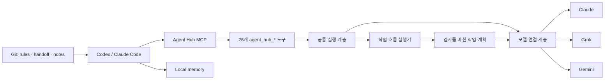

# Agent Hub

Claude, Grok, Gemini를 MCP 서버 하나에서 쓰는 개인용 멀티모델 작업 환경입니다.

클라이언트에는 `agent-hub-mcp`만 연결합니다. 한 번에 끝나는 일은 원하는 모델에 바로 맡기고, 여러 단계가 필요한 일은 작업 흐름(workflow)으로 묶습니다. 규칙과 작업 기록은 특정 AI 앱에 묶이지 않도록 Git과 로컬 파일에 둡니다.

> Agent Hub는 Anthropic, xAI, Google의 공식 제품이 아닙니다. 각 서비스의 계정, 구독, 사용 정책, 사용량 제한은 직접 확인해야 합니다.

## 한눈에 보기

- **MCP 서버 1개**: `agent-hub-mcp`
- **공개 도구 26개**: 모두 `agent_hub_*` 이름과 같은 결과 형식을 사용합니다.
- **연결 대상 3곳**: Claude, Grok, Gemini. 문서에서는 각 연결 대상을 provider라고 부릅니다.
- **작업 흐름 5종**: `repo_document`, `git_document`, `research_brief`, `deep_readme`, `adaptive`
  - `readme`, `pr-description` 같은 preset은 작업 흐름 안에서 고르는 실행 옵션입니다. 별도 작업 흐름으로 세지 않습니다.
- **상황에 맞춘 작업 분담**: `adaptive`는 필요한 앞 단계가 끝난 작업끼리 동시에 실행할 수 있습니다.
- **공통 규칙**: Ruler 원본에서 `AGENTS.md`, `CLAUDE.md`와 클라이언트 설정을 생성합니다.
- **작업 인계**: `HANDOFF.md`와 Git으로 다른 AI 클라이언트에서 이어서 작업할 수 있습니다.

## 구조



클라이언트에서 호출하는 이름은 `agent_hub_*` 26개뿐입니다. 모델별 내부 도구는 통합 MCP의 `tools/list`나 `tools/call`에 나타나지 않습니다.

## 지원 범위

아래 표는 각 회사 제품의 전체 기능이 아니라 Agent Hub의 연결 코드에 구현된 범위입니다. 계정이나 구독에 따라 실제 호출 가능 여부는 달라질 수 있습니다.

| 작업 | Claude | Grok | Gemini | Hub·로컬 |
|---|:---:|:---:|:---:|:---:|
| 대화 | ✓ | ✓ | ✓ |  |
| 상태·모델 목록·로그인 | ✓ | ✓ | ✓ |  |
| 이미지·프레임 분석 | ✓ | ✓ | ✓ | 입력 정규화 |
| 근거가 포함된 검색 | ✓ | ✓ | ✓ | 출처 형식 통합 |
| 초안·번역·윤문·요약 | ✓ | ✓ | ✓ | 공통 요청 형식과 검증 |
| 이미지 생성 |  | ✓ | ✓ | 로컬 캐시 |
| 모델 비교 | ✓ | ✓ | ✓ | 여러 모델 동시 실행 |
| Git diff 검토 | ✓ | ✓ | ✓ | diff 수집 |
| 릴리스 스냅샷 |  |  |  | ✓ |
| 릴리스 문서 | ✓ | ✓ | ✓ | Git 사실 수집 |
| 모델 설정 | ✓ | ✓ | ✓ | 모델별 설정 적용 |
| transport·profile 설정 |  |  | ✓ |  |

대화·이미지 분석·글쓰기·Git 변경 검토는 현재 로그인 방식으로 쓸 수 있습니다. Claude와 Grok의 자체 검색 기능, Grok 이미지 생성은 계정의 API 권한이 따로 필요할 수 있으므로 실제 호출 결과까지 확인하세요.

`agent_hub_chat`은 `provider=claude|grok|gemini`로 모델을 직접 고를 수 있습니다. `provider=auto`는 전달한 모델 이름으로 경로를 정하고, 모델을 지정하지 않으면 Claude를 씁니다. 검색·글쓰기·diff 검토·릴리스 문서는 세 provider를 선택할 수 있고, 이미지 생성은 Grok과 Gemini를 지원합니다.

## 설치

### 필요한 환경

- Python 3.10 이상
- Node.js와 `npx`: Ruler 규칙 동기화에 사용합니다.
- `uv` 또는 `uvx`: 로컬 공유 메모리를 쓸 때 필요합니다.
- 사용할 모델 서비스의 계정, 구독 또는 API 키

### 1. 저장소 설치

아래 예시의 `<REPO_ROOT>`는 저장소를 clone한 실제 절대경로로 바꿔서 씁니다.

```bash
git clone https://github.com/Meapri/agent-hub.git
cd agent-hub

python3 -m venv .venv
./.venv/bin/pip install -e '.[dev]'
./.venv/bin/pytest -q
```

설치가 끝나면 `.venv/bin/agent-hub-mcp`가 생깁니다. 모델별 MCP 실행 파일은 따로 설치하지 않습니다.

### 2. 로컬 경로 설정

[`instructions/.ruler/ruler.toml`](./instructions/.ruler/ruler.toml)에서 아래 값을 clone 위치에 맞게 고칩니다.

- `BASIC_MEMORY_CONFIG_DIR`
- `BASIC_MEMORY_HOME`
- `mcp_servers.agent-hub.command`

수정 뒤에는 생성물이 원본과 일치하는지 확인합니다.

```bash
./scripts/sync.sh
./scripts/check-sync.sh
```

### 3. 모델 서비스 사용 동의

외부 모델을 호출하기 전에 사용할 서비스에 명시적으로 동의해야 합니다. 쓰지 않는 서비스에는 동의하지 않아도 됩니다.

```bash
./.venv/bin/claude-codex-consent grant --i-understand-and-consent
./.venv/bin/grok-codex-consent grant --i-understand-and-consent
./.venv/bin/google-antigravity-consent grant --i-understand-and-consent
```

동의를 취소하려면 해당 명령의 `grant`를 `revoke`로 바꿔 실행합니다.

### 4. 로그인

Claude:
```bash
claude auth login --claudeai
./.venv/bin/python scripts/claude_codex_login.py mirror-keychain
./.venv/bin/python scripts/claude_codex_login.py status
```

Grok:
```bash
./.venv/bin/python scripts/grok_codex_login.py interactive
./.venv/bin/python scripts/grok_codex_login.py status
```

Google Antigravity:
```bash
./.venv/bin/python scripts/google_antigravity_login.py interactive
./.venv/bin/python scripts/google_antigravity_login.py status
```

### 5. 설치 확인 (Doctor)

```bash
./scripts/doctor.sh
```

`doctor.sh`는 규칙 동기화, Python 패키지, basic-memory, 통합 MCP 실행 파일, 메모리 저장소를 확인합니다. 모델별 동의·로그인 상태는 MCP 연결 뒤 `agent_hub_status`에서 확인합니다.

### 6. 앱 플러그인 설치

Agent Hub는 Codex와 Claude Code에 붙는 플러그인 예시를 제공합니다. 아래 명령으로 각 클라이언트에 설치합니다.

**Codex:**
```bash
codex plugin marketplace add <REPO_ROOT>
codex plugin add agent-hub@agent-hub
codex plugin list
```

**Claude Code:**
```bash
claude plugin marketplace add <REPO_ROOT>
claude plugin install agent-hub@agent-hub --scope user
claude plugin list
```

클라이언트별 설정 예시는 [`hubs/codex/`](./hubs/codex/)와 [`hubs/claude-code/`](./hubs/claude-code/)에서도 볼 수 있습니다.

## 첫 실행

설치와 로그인을 마친 클라이언트에서 아래를 순서대로 시도하세요.

1. `agent_hub_status`로 쓸 provider만 동의·로그인·ready인지 확인합니다. 쓰지 않는 provider가 not ready여도 정상입니다.
2. `agent_hub_list_workflows`로 workflow 5종과 preset 목록이 보이는지 확인합니다.
3. `agent_hub_chat`에서 `provider=claude`(또는 로그인한 provider)로 "설치가 잘 됐는지 한 문장으로 확인해줘"라고 물어봅니다.

`status`가 사용 예정 provider를 정상으로 보여주고 `chat`이 응답하면 MCP 연결은 끝난 것입니다. memory 서버나 basic-memory는 핵심 대화에 필수가 아니므로, `doctor.sh`에서 memory만 실패해도 chat 경로와 별개로 보면 됩니다.

## 작업을 실행하는 세 가지 방법

Agent Hub 실행 방식은 세 갈래입니다.

1. **직접 호출** — 도구 하나를 한 번 부릅니다. 모델과 작업을 사용자가 정합니다. 빠르고 예측 가능하며 중간 결과를 눈으로 확인하기 좋습니다.
   ```text
   agent_hub_review_diff로 현재 저장소 변경에서 버그와 빠진 테스트를 찾아줘.
   ```
2. **고정 작업 흐름** — `repo_document`, `deep_readme`처럼 미리 정해 둔 단계와 모델 역할을 따릅니다. 같은 순서로 반복하는 작업에 맞습니다.
3. **상황에 맞춘 작업 분담** — `adaptive`를 사용합니다. 계획을 맡은 모델이 필요한 단계, 각 단계를 맡을 모델, 실행 순서, 실패했을 때 대신 부를 모델을 정합니다.
   ```text
   agent_hub_plan_workflow를 workflow_id=adaptive로 호출해줘.
   prompt에는 목표를, project_root에는 현재 저장소 절대경로(<REPO_ROOT>)를 넣고 policy_mode=required로 설정해줘.
   ```

Agent Hub는 이 계획을 바로 실행하지 않습니다. 사용할 수 있는 기능과 모델만 들어 있는지, 서로 계속 기다리는 단계나 결과에 연결되지 않은 단계가 없는지 확인합니다. 마지막 결과를 만드는 단계가 하나뿐인지, 설정한 최대 호출 횟수를 넘지 않는지도 검사합니다.

검사를 통과한 plan에는 `plan_sha256`이 붙습니다. 실행할 때 같은 plan을 전달하면 계획 모델을 다시 부르지 않습니다. 검토한 계획과 실제로 실행하는 계획이 달라지는 일을 막기 위한 장치입니다.

```text
agent_hub_run_workflow를 workflow_id=adaptive로 호출하고, 방금 검토한 plan을 전달해줘.
max_concurrency=3, max_leaf_calls=9로 제한해줘.
```

`max_concurrency`는 한 번에 실행할 수 있는 단계 수이고, `max_leaf_calls`는 한 작업에서 모델을 부를 수 있는 최대 횟수입니다. 처음에는 각각 2~3개와 6~9회 정도로 작게 두고, 계획의 단계 수와 계정 한도를 확인한 뒤 늘리는 편이 안전합니다.

실행 순서는 Claude, Grok, Gemini처럼 모델 이름으로 고정하지 않습니다. 필요한 앞 단계가 끝난 작업부터 실행합니다. 한 모델이 실패하면 계획에 적힌 대체 모델을 차례로 시도하고, 모두 실패하면 그 결과가 필요한 뒤 작업은 시작하지 않습니다.

**정리:** 할 일이 한 도구로 끝나면 직접 호출, 검증된 문서/조사 파이프라인이면 고정 workflow, 작업 구조 자체를 맡기려면 adaptive입니다.

## 선택지가 정해진 판단 비교하기

Consistency Gate는 여러 모델의 답을 **미리 정한 선택지**로 모을 때만 씁니다. 자유롭게 작성한 글의 품질에 점수를 붙이는 기능이 아닙니다.

```text
agent_hub_compare_models
  providers=["claude", "grok", "gemini"]
  prompt="이 변경을 merge해도 되는가?"
  consistency.decision_labels=["approve", "reject", "needs_human_review"]
```

Agent Hub는 필요한 응답이 모두 왔는지, 같은 프로젝트 규칙과 같은 요청을 사용했는지, 응답 형식과 합의 기준을 지켰는지 확인합니다.

- **계약을 지키면:** 라벨 분포와 합의 결과를 반환합니다.
- **일부 provider만 실패:** 성공 결과는 유지하고 `partial_compare_failures` warning을 남길 수 있습니다 (`consistency` 없이도 동일).
- **계약 위반·기준 미달:** 결론을 꾸며내지 않고 사람 검토가 필요하다고 반환합니다.

## Workflow

아래는 **작업 흐름 5종**입니다. `Preset` 열은 같은 작업 흐름 안에서 고르는 실행 옵션입니다. `adaptive`만 필요한 앞 단계가 끝난 작업을 동시에 실행할 수 있고, 나머지 네 가지는 정해 둔 순서를 따릅니다.

| Workflow | Preset | 처리 흐름 |
|---|---|---|
| `repo_document` | `readme` | 저장소 사실 수집 → README 작성 → 검증 |
| `repo_document` | `technical-doc` | 저장소 사실 수집 → 기술 문서 작성 → 검증 |
| `repo_document` | `proposal` | 저장소 사실 수집 → 제안서 작성 → 검증 |
| `git_document` | `pr-description` | Git 변경 수집 → PR 설명 작성 |
| `git_document` | `release-notes` | Git 변경 수집 → 릴리스 노트 작성 |
| `research_brief` | `default` | 근거 검색 → 출처 기반 요약 → 검증 |
| `deep_readme` | `default` | Claude 구조 분석 → Grok 사용성 분석 → Gemini 작성 → 검증 |
| `adaptive` | `llm-planned` | 모델이 계획 작성 → 로컬 검사 → 준비된 단계 동시 실행 → 최종 결과 작성 |

### Workflow를 단계별로 실행하기

중간 결과를 직접 확인하고 싶을 때 씁니다.

1. `agent_hub_plan_workflow`로 계획을 확인합니다.
2. `agent_hub_start_workflow`로 실행을 시작합니다.
3. 반환된 다음 작업을 실행하고, 결과를 `agent_hub_continue_workflow`에 전달합니다.
4. 완료 결과를 `agent_hub_verify`로 다시 확인합니다.

### Workflow를 끝까지 자동 실행하기

```text
agent_hub_run_workflow로 deep_readme를 실행해줘.
project_root는 <REPO_ROOT>를 사용하고 max_leaf_calls는 8로 제한해줘.
```

자동 실행도 provider별 동의와 인증 검사를 건너뛰지 않습니다.

## 공개 도구 26개

### Provider와 인증
| 도구 | 용도 |
|---|---|
| `agent_hub_status` | 동의, 인증, 준비 상태와 기본 모델 확인 |
| `agent_hub_list_models` | 모델 목록 조회와 선택적 live probe |
| `agent_hub_auth_start` | provider별 로그인 시작 |
| `agent_hub_auth_complete` | 브라우저·device-code 로그인 완료 |
| `agent_hub_auth_refresh` | OAuth 토큰 갱신 또는 검증 |
| `agent_hub_auth_logout` | 로컬 OAuth 정보 삭제 |

### 직접 작업
| 도구 | 용도 |
|---|---|
| `agent_hub_chat` | Claude, Grok, Gemini 대화 |
| `agent_hub_search` | Claude web search, Grok web·X search, Gemini grounding |
| `agent_hub_write` | 선택한 provider로 초안, 번역, 윤문, 재작성, 요약 |
| `agent_hub_generate_image` | Grok·Gemini 이미지 생성과 로컬 캐시 저장 |
| `agent_hub_compare_models` | 같은 입력을 Claude·Grok·Gemini에서 비교 |
| `agent_hub_review_diff` | 로컬 Git diff 수집 후 선택한 provider로 검토 |
| `agent_hub_release_snapshot` | 모델 호출 없이 로컬 릴리스 정보 수집 |
| `agent_hub_release_draft` | 로컬 초안 생성과 선택적 provider 윤문 |

### 설정
| 도구 | 용도 |
|---|---|
| `agent_hub_get_settings` | provider별 기본 모델과 적용 범위 조회 |
| `agent_hub_update_settings` | Claude·Grok 모델 기본값 또는 Gemini 설정 변경 |
| `agent_hub_reset_settings` | provider 일부 또는 전체 설정 초기화 |

### Workflow
| 도구 | 용도 |
|---|---|
| `agent_hub_list_workflows` | workflow와 preset 목록 조회 |
| `agent_hub_get_workflow` | 단계, context policy, binding 설명 |
| `agent_hub_plan_workflow` | 실행하지 않고 구체적인 단계 생성 |
| `agent_hub_start_workflow` | 단계별 실행 시작 |
| `agent_hub_continue_workflow` | 한 단계의 결과를 전달하고 다음 단계 진행 |
| `agent_hub_get_run` | 저장된 실행 상태 조회 |
| `agent_hub_run_workflow` | in-process adapter로 끝까지 자동 실행 |
| `agent_hub_delegate` | capability, context, fallback을 포함한 단일 호출 준비 |
| `agent_hub_verify` | 문서 정책과 저장소 사실을 기준으로 결과 검증 |

## 공통 결과 형식

모든 통합 도구는 MCP의 `content[]`, `isError`, `structuredContent`를 반환합니다. `structuredContent`에서는 아래 필드를 공통으로 씁니다.

```json
{
  "success": true,
  "operation": "chat",
  "provider": "gemini",
  "model": "selected-model",
  "text": "result text",
  "finish_reason": "stop",
  "usage": {},
  "warnings": [],
  "error": null,
  "artifacts": [],
  "data": {}
}
```

모델이 출력 한도에 걸려 문장이 잘리면 정상 완료로 처리하지 않습니다. 이때는 `success=false`와 `incomplete_finish_reason` warning을 확인하세요.

## 이미지나 프레임 분석하기

```text
agent_hub_chat에서 provider=claude로 이 프레임의 자세와 가려진 관절을 설명해줘.
images에는 프레임 경로를, workspace_root에는 그 파일이 든 작업 폴더의 절대경로를 넣어줘.
```

같은 요청을 `provider=grok`, `provider=gemini`로 반복하면 프레임별 판단을 교차 검토할 수 있습니다. 로컬 파일은 지정한 `workspace_root` 안에 있어야 하고, JPEG·PNG·GIF·WebP 파일 하나는 20 MiB를 넘을 수 없습니다.

## 규칙, 메모리, 작업 인계

| 정보 | 저장 위치 | 역할 |
|---|---|---|
| 공통 AI 규칙 | [`instructions/.ruler/`](./instructions/.ruler/) | 여러 클라이언트에 같은 규칙 배포 |
| 생성된 규칙 | `AGENTS.md`, `CLAUDE.md` | Codex, Claude Code, Gemini, Cursor가 읽는 결과물 |
| 진행 상태 | [`HANDOFF.md`](./HANDOFF.md) | 중단 지점과 다음 작업 기록 |
| 장기 메모리 | [`memory/data/`](./memory/data/) | 결정과 반복해서 피해야 할 실수 기록 |
| 코드와 변경 이력 | Git | 실제 상태의 기준 |

basic-memory는 이전 기록을 찾을 때 쓰는 보조 기능입니다. 기본 설정에서는 임베딩 검색을 끄고 FTS 텍스트 검색만 사용합니다. 코드와 현재 진행 상태는 Git과 `HANDOFF.md`에서 확인합니다.

## 안전 경계

- 각 provider는 별도의 명시적 동의를 확인합니다. 동의하지 않은 provider 호출은 실패하는 것이 정상입니다.
- `agent_hub_chat`의 `provider=auto`에서 모델을 생략하면 Claude 경로를 씁니다. 의도적으로 다른 모델을 쓰려면 `provider` 또는 모델 이름을 명시하세요.
- adapter에 구현된 기능과 현재 계정의 native API 권한은 다릅니다. 표의 ✓는 “이 저장소 adapter 범위”입니다.
- OAuth 토큰과 API 키는 사용자 설정 디렉터리, Keychain 또는 환경변수에만 둡니다. 저장소에 커밋하지 않습니다.
- source file, Git diff, 저장소 사실을 읽는 도구에는 대상 workspace의 **절대경로**를 넣습니다.
- 홈 디렉터리 전체, 파일시스템 루트, 민감한 인증 경로는 workspace root로 쓸 수 없습니다.
- 고정 작업 흐름, `adaptive`, `compare_models`는 외부 모델을 여러 번 부를 수 있습니다. `max_leaf_calls`로 최대 호출 횟수, `max_concurrency`로 동시 실행 수, `per_call_timeout`으로 한 번의 대기 시간, `max_tokens`로 응답 길이를 제한하세요.
- 테스트 성공은 실시간 구독 한도나 모델 응답 품질을 보장하지 않습니다.

## 이전 이름은 지원하지 않습니다

통합 전 쓰던 `orchestrate_*`, `claude_codex_*`, `grok_codex_*`, `google_antigravity_*` 이름은 `agent-hub-mcp`에 등록되지 않습니다. 호출하면 `unknown tool` 오류가 납니다. 새 설정에서는 반드시 `agent_hub_*` 도구를 씁니다.

## 저장소 구조

```text
agent-hub/
├── src/agent_hub/                 # 통합 MCP 서버와 공개 도구
│   ├── operations.py              # 26개 도구의 입력 형식과 실행 연결
│   ├── capabilities.py            # 모델별 지원 기능
│   ├── consistency.py             # Consistency Gate 검사
│   ├── provider_settings.py       # Claude·Grok 기본 설정 저장
│   ├── server.py                  # MCP 요청과 응답 처리
│   ├── core/                      # 파일 입력, 통신, 공통 보안 기능
│   └── providers/                 # 모델별 연결 코드
├── src/orchestrate_codex/         # 작업 흐름, 실행 상태, 검증
├── src/claude_codex/              # Claude 연결 코드
├── src/grok_codex/                # Grok 연결 코드
├── src/google_antigravity_codex/  # Gemini 연결 코드
├── tests/                         # 단위·통합·MCP 형식 테스트
├── instructions/.ruler/           # 공통 AI 규칙의 원본
├── memory/data/                   # Git으로 관리하는 로컬 메모리
├── handoff/                       # 작업 인계 템플릿과 예시
├── hubs/                          # Codex와 Claude Code 연결 예시
├── scripts/                       # 로그인, 동기화, 진단, 검증 도구
├── plugins/                       # 통합 전 자료와 모델별 보안 참고 문서
├── model-access/                  # 통합된 코드의 출처와 실행 근거
└── HANDOFF.md                     # 현재 진행 상태
```

## 개발과 검증

```bash
./.venv/bin/ruff check src tests
./.venv/bin/pytest -q
./scripts/check-sync.sh
./scripts/test-phase1.sh
./scripts/doctor.sh
./.venv/bin/python -m build
```

## 라이선스

MIT 라이선스를 씁니다. 통합된 구성요소의 출처와 저작권 정보는 [`NOTICE.md`](./NOTICE.md)에서 확인할 수 있습니다.
