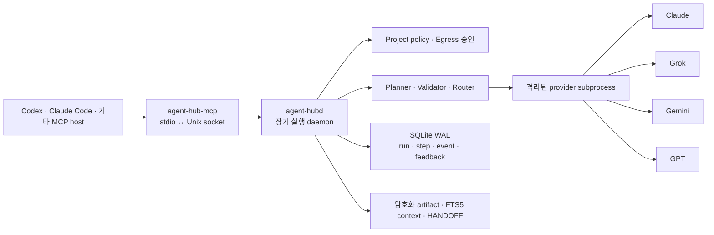

# Agent Hub

Agent Hub는 Claude, Grok, Gemini, GPT를 하나의 로컬 실행 환경에서 사용하는 macOS용
멀티 모델 작업 플랫폼입니다. MCP 호스트에는 가벼운 bridge만 연결하고, 계획·실행·복구·정책·
artifact 관리는 장기 실행 daemon이 맡습니다.

- 현재 버전: `2.1.3`
- Python: 3.10 이상
- 우선 지원 환경: macOS 단일 사용자
- 라이선스: MIT

설치되는 MCP 표면은 아래의 14개 도구로 하나뿐입니다. provider별 adapter와 내부 실행 도구는
daemon 뒤에 숨겨져 Codex나 Claude Code에 별도 MCP로 노출되지 않습니다.

Agent Hub는 Anthropic, xAI, Google, OpenAI의 공식 제품이 아닙니다. 실제 호출에는 각 계정의
사용량·요금·데이터 정책이 적용됩니다.

## 왜 Agent Hub인가요?

- **호스트와 실행 수명을 분리합니다.** Codex나 Claude Code의 MCP 연결이 끊겨도 run과
  checkpoint는 daemon의 SQLite 저장소에 남습니다.
- **네 provider를 같은 작업 계약으로 다룹니다.** 인증 구현은 provider별로 달라도
  `task_v2`, worker ABI, model 상태, 오류 envelope는 공통 형식을 사용합니다.
- **긴 작업을 안전하게 이어갑니다.** revision, lease, idempotency key로 동시 실행과 중복
  요청을 제어하고, 외부 요청의 결과가 불명확하면 임의 재호출 대신 `outcome_unknown`으로
  멈춥니다.
- **저장소 전송 범위를 먼저 보여 줍니다.** 외부 planner를 호출하기 전에 fact pack과
  `egress_manifest_v2`를 만들고 파일뿐 아니라 실제 호출 가능한 provider destination, digest와
  policy revision을 확인합니다.
- **결과의 출처를 남깁니다.** 암호화된 artifact가 producer step과 source artifact를 참조하며,
  run event에는 prompt나 결과 원문 대신 안전한 상태와 digest metadata만 기록합니다.
- **라우팅을 설명할 수 있습니다.** planner 선택, 후보 제외 이유, 점수 구성, 표본 수를
  `routing_decision_v1`으로 남깁니다.

## 아키텍처



| 구성 요소 | 역할 |
| --- | --- |
| `agent-hub-mcp` | stdio MCP 요청을 Unix socket으로 전달하는 무상태 bridge |
| `agent-hubd` | 정책, planning, routing, durable run, artifact를 관리하는 사용자별 daemon |
| Provider worker | `initialize`, `status`, `catalog`, `invoke`, `cancel`, `shutdown` NDJSON ABI를 구현하는 subprocess |
| SQLite store | run, step, lease, event, routing decision, feedback, artifact metadata, FTS5 index와 content-free operation metric 저장 |
| 연결 GUI | 로그인·다시 로그인·로그아웃·consent·모델 선택·generation test 관리 |

기본 상태 디렉터리는 `~/.agent-hub`이고 `0700` 권한을 사용합니다. SQLite DB는
`~/.agent-hub/state.sqlite3`, socket은 `~/.agent-hub/run/agent-hub.sock`이며 둘 다
`0600`으로 제한됩니다. DB는 WAL mode와 schema migration 전 backup·integrity check를
사용합니다.

## 설치와 시작

```bash
git clone https://github.com/Meapri/agent-hub.git
cd agent-hub
./scripts/bootstrap.sh
```

bootstrap은 Python 3.10 이상을 찾아 `.venv`를 만들고 개발 의존성을 설치합니다. macOS에
포함된 Python 3.9는 사용하지 않습니다. 사용할 interpreter를 직접 지정하려면
`AGENT_HUB_PYTHON=/path/to/python3.12 ./scripts/bootstrap.sh`처럼 실행하세요.

### 1. 프로젝트 정책 준비

`init`은 바로 파일을 쓰지 않고 프로젝트의 `.agent-hub` 디렉터리에 둘 `project.toml`
변경안을 먼저 출력합니다.

```bash
./.venv/bin/agent-hub init --project-root . --json
./.venv/bin/agent-hub init \
  --project-root . \
  --apply \
  --proposal-sha256 검토한_SHA256 \
  --json
```

첫 명령의 `proposal_sha256`과 내용을 검토한 뒤 같은 digest로 적용하세요.

### 2. daemon과 MCP host 연결

`setup`도 prepare/apply 방식입니다. Codex, Cursor, Gemini CLI, 일반 MCP 설정과
Codex·Claude Code hub 설정의 변경안, macOS LaunchAgent 변경안을 함께 보여 줍니다.

```bash
./.venv/bin/agent-hub setup --repo-root . --json
./.venv/bin/agent-hub setup --repo-root . --apply \
  --proposal-sha256 검토한_SHA256 --json
```

적용하면 `~/Library/LaunchAgents/com.agent-hub.daemon.plist`를 설치하고 daemon을
활성화합니다. setup은 dependency 설치, provider 로그인, network 호출, 전역 plugin 등록을
수행하지 않습니다.

checkout과 실행 파일 수명을 분리하려면 먼저 변경 digest가 포함된 versioned runtime을
staging한 뒤 그 경로로 setup하세요.

```bash
# 1. immutable runtime 제안 검토
./.venv/bin/agent-hub stage-release --repo-root . --json

# 2. 같은 digest로 staging 적용
./.venv/bin/agent-hub stage-release --repo-root . --apply \
  --proposal-sha256 검토한_SHA256 --json

# 3. 결과의 runtime_root를 host와 LaunchAgent에 연결
./.venv/bin/agent-hub setup --repo-root . \
  --runtime-root ~/.agent-hub/releases/2.1.3-소스_DIGEST \
  --json
```

`stage-release`는 `pyproject.toml`, `README.md`, `LICENSE`, `NOTICE.md`, `src/`의 content
digest와 Python 버전·실행 파일 digest를 고정합니다. 적용할 때 별도 venv에 non-editable package를 설치하고 `agent-hubd`,
`agent-hub-mcp`, `agent-hub` entrypoint를 검사한 뒤에만 최종 경로로 atomic rename합니다.
dependency resolution에는 network가 필요할 수 있으며, 이미 존재하는 release 경로는 덮어쓰지
않습니다.

`setup` proposal은 daemon과 bridge 실행 파일 digest도 고정합니다. host 설정과 LaunchAgent
적용·활성화 중 하나라도 실패하면 이미 쓴 host 파일과 LaunchAgent를 검토 전 상태로 되돌립니다.

foreground에서 직접 실행하려면 다음 명령을 사용합니다.

```bash
./.venv/bin/agent-hubd
```

### 3. 상태 확인

```bash
./.venv/bin/agent-hub doctor --project-root . --json
```

daemon, DB integrity와 schema, socket, 설치 상태를 읽기 전용으로 확인합니다. 수리 계획이
필요하면 `agent-hub doctor --repair` 또는 `agent-hub repair`로 proposal을 먼저 만드세요.

## Provider 연결과 모델 관리

인증 변경은 MCP 도구가 아니라 로컬 GUI에서 수행합니다.

```bash
./.venv/bin/agent-hub-connect
```

GUI는 `127.0.0.1`의 임의 포트에 뜨며 브라우저를 엽니다. 다음 기능을 provider별로 관리합니다.

- 로그인, 다시 로그인, 로그아웃, consent
- live catalog 새로고침과 cached/static fallback 구분
- 기본 text model 선택·초기화
- opt-in generation test와 진행 중 job 취소
- credential을 제외한 진단 정보 복사

모델 상태는 한 개의 “연결됨” 표시로 합치지 않습니다.

- `auth_state`: 현재 호출 가능한 인증인지
- `catalog_state`: `live`, `cached`, `static_fallback`, `unavailable`
- `generation_state`: 실제 짧은 생성이 `verified`, `failed`, `unknown` 중 무엇인지

catalog가 보인다고 실제 생성까지 검증된 것은 아닙니다. 중요한 모델은 GUI의 generation test로
확인하세요. `MODEL_PLACEHOLDER_*`, `model_internal`, `*-placeholder` 형식은 generation 전에
거부됩니다.

| Provider | v2 capability | 인증 소유자 |
| --- | --- | --- |
| Claude | chat, search, vision, write, review, decide | Claude Code |
| Grok | chat, search, vision, image, write, review, decide | Agent Hub |
| Gemini | chat, search, vision, image, write, review, decide | Agent Hub |
| GPT | chat, vision, write, review, decide | Codex |

GUI를 사용할 수 없는 환경에서는 consent와 provider 로그인을 별도 CLI로 진행할 수 있습니다.

```bash
./.venv/bin/claude-codex-consent grant --i-understand-and-consent
./.venv/bin/grok-codex-consent grant --i-understand-and-consent
./.venv/bin/google-antigravity-consent grant --i-understand-and-consent
./.venv/bin/openai-codex-consent grant --i-understand-and-consent

claude auth login --claudeai
codex login
codex login --device-auth

./.venv/bin/python scripts/grok_codex_login.py interactive
./.venv/bin/python scripts/google_antigravity_login.py interactive
```

host plugin을 직접 등록하려면 다음 명령을 사용합니다.

```bash
codex plugin marketplace add /absolute/path/to/agent-hub
codex plugin add agent-hub@agent-hub

claude plugin marketplace add /absolute/path/to/agent-hub
claude plugin install agent-hub@agent-hub --scope user
```

## 공개 MCP 도구 14개

공개 도구는 정확히 14개입니다.

| 도구 | 역할 |
| --- | --- |
| `agent_hub_status` | daemon, store, provider manifest와 readiness 조회 |
| `agent_hub_catalog` | provider·model·capability와 auth/catalog/generation 상태 조회 |
| `agent_hub_execute` | durable run을 만들지 않는 짧은 단일 작업 실행 |
| `agent_hub_plan` | local fact pack·egress proposal 준비 또는 승인된 planner 호출 |
| `agent_hub_start` | 승인된 `plan_v2`로 idempotent durable run 생성 |
| `agent_hub_continue` | expected revision으로 run을 claim하고 다음 dependency-ready wave 접수 |
| `agent_hub_get` | run과 step checkpoint 조회 |
| `agent_hub_events` | cursor 기반 redacted event 조회 |
| `agent_hub_cancel` | expected revision으로 run과 active worker 취소 |
| `agent_hub_artifact` | artifact 조회·인증 검증·digest-fenced export·retention 처리 |
| `agent_hub_feedback` | rating과 accepted/partial/rejected/verified/failed 결과 기록 |
| `agent_hub_policy` | project policy 조회와 prepare/apply 변경 |
| `agent_hub_handoff` | 프로젝트 `HANDOFF.md`와 takeover prepare/apply |
| `agent_hub_doctor` | read-only 진단과 repair plan 생성 |

모든 mutation은 `idempotency_key` 또는 `expected_revision`을 요구합니다. 공개 오류는
`code`, `scope`, `retryable`, `safe_details`, 선택적 `next_action`을 사용하며 raw exception,
credential, prompt와 결과 본문을 event에 넣지 않습니다.

## 계획부터 실행까지

저장소 파일이나 기존 artifact를 사용하는 작업은 `agent_hub_plan`의 두 단계 경계를 거칩니다.

1. `mode="prepare"`가 project-relative `source_paths`를 읽어 secret 후보를 줄 단위로 제외하고
   `fact_pack_v2`, `egress_manifest_v2`, `proposal_sha256`을 만듭니다. 수집 시각은 content
   identity에서 제외하므로 파일 내용이 같으면 digest도 같습니다. 이 단계에서는 provider를
   호출하지 않습니다.
2. manifest의 destination provider, 포함 파일, 문자 수, digest, policy revision을 검토합니다.
3. `mode="apply"`에 같은 proposal과 digest를 전달하면 planner가 DAG를 제안합니다.
4. 로컬 validator가 capability, dependency, cycle, provider-call budget과 승인된 destination을
   다시 검사합니다. planner가 승인 밖 provider나 source를 요청하면 외부 실행 전에 거부합니다.
5. `agent_hub_start`로 run을 만들고 `agent_hub_continue`로 실행 wave를 접수합니다.
6. `agent_hub_get`과 `agent_hub_events`로 진행 상태를 확인합니다. event에는 content를 넣지
   않고 provider attempt의 시작·실패·완료, 안전한 reason code와 소요 시간만 남기며 결과는
   artifact ID로 읽습니다.

짧은 inline 작업인 `agent_hub_execute`도 `project_root`가 필수입니다. 이를 생략해 project policy,
provider/model allowlist, egress와 budget 제한을 우회할 수 없습니다.

`agent_hub_continue`는 외부 생성을 기다리지 않고 receipt를 반환합니다. daemon은 한 wave에서
dependency가 모두 충족된 step을 최대 네 개까지 병렬 실행합니다. run lease는 프로젝트의
time budget에 grace를 더해 잡고 최대 1시간으로 제한합니다. 병렬 step의 시간 사용량은 단순 합이
아니라 DAG critical path로 계산합니다. 먼저 끝난 provider 결과는 같은 wave의 느린 호출을 기다리지
않고 즉시 checkpoint하며, 각 step은 실제 입력 artifact ID를 provenance로 남깁니다. 실행 중에는
claim token과 revision을 확인해 lease를 갱신하므로 정상적인 장기 호출이 만료 lease로 오인되지
않습니다.

외부 요청을 보냈는지 알 수 없는 timeout, worker crash, protocol 장애는 자동 재호출하지 않고
`outcome_unknown`으로 멈춥니다. daemon 재시작이나 lease 만료 때 local retry-safe step만 다시
queue에 넣고, 외부 step의 모호한 결과는 그대로 보존합니다.

## Routing과 feedback

기본 profile은 `quality_balanced`, 기본 mode는 `shadow`입니다.

| 점수 요소 | 가중치 |
| --- | ---: |
| 품질 | 60% |
| 신뢰성 | 20% |
| 지연시간 효율 | 10% |
| token 효율 | 10% |

| Mode | 동작 |
| --- | --- |
| `pinned` | 명시적으로 지정한 provider를 유지 |
| `shadow` | planner 선택을 유지하고 대안 점수만 기록 |
| `advisory` | 추천을 기록하지만 실제 선택은 유지 |
| `auto` | 동일 context에서 planner와 추천 후보가 각각 20건 이상일 때만 guardrail 평가 |

`auto`도 품질·실패율 하한과 material gain 조건을 통과하지 못하면 planner 선택을 유지합니다.
mode는 자동 승격되지 않습니다. 호출 성공만으로 품질 1.0을 기록하지 않습니다. 학습 신호에는
사용자 rating, 명시적 `json`·`contains`·`sha256` deterministic verifier,
accepted/partial/rejected 결과를 사용하고 30일 half-life를 적용합니다. fallback 목록을 명시한
step은 그 순서와 범위 안에서만 대체 provider를 호출합니다.

## Project policy

프로젝트별 설정은 `.agent-hub` 디렉터리의 `project.toml`에 있습니다.

```toml
schema = "agent_hub_project_policy_v2"
revision = 0
routing_profile = "quality_balanced"
routing_mode = "shadow"
provider_allowlist = ["claude", "grok", "gemini", "gpt"]
model_allowlist = []
artifact_retention = "durable_private"

[egress]
repository_content = "approval_required"
artifact_content = "approval_required"
inline_prompt = "allowed"

[budgets]
timeout_seconds = 1790
max_leaf_calls = 100
max_tokens = 131072

[experimental]
isolated_tool_worker = false
local_model = false
remote_worker = false
```

`agent_hub_policy`와 `agent-hub init`은 revision과 proposal digest를 검사한 뒤 atomic replace를
사용합니다. `workflow_locks`, `plugin_locks`, provider/model allowlist도 같은 파일에서 관리합니다.

## 보안과 데이터 경계

- built-in provider는 daemon과 분리된 subprocess에서 실행됩니다.
- macOS worker는 `sandbox-exec`으로 임의 outbound TCP/UDP를 차단하고 현재 request의 localhost
  proxy port 하나만 허용합니다. proxy는 provider manifest에 선언된 domain만 통과시킵니다. worker는 provider별
  allowlist에 없는 환경변수를 상속하지 않고 임시 작업 디렉터리에서 실행되며, 파일 쓰기는 임시
  디렉터리와 해당 provider의 config/cache로 제한됩니다.
- timeout과 cancel은 worker 한 프로세스가 아니라 새 session의 process group에 전달됩니다.
- 긴 비스트리밍 생성도 provider timeout 범위 안에서 유지되도록 proxy idle timeout을 같은
  상한으로 맞춥니다.
- durable 입력과 결과 artifact는 AES-GCM으로 암호화하며 data key는 macOS Keychain에 둡니다.
  SQLite DB 전체가 암호화되는 것은 아닙니다.
- local context index는 `.gitignore`, 확장자·파일 크기·전체 크기 제한을 따르며 cloud embedding을
  호출하지 않습니다. 색인하기 전에 credential 후보가 있는 줄을 redaction합니다. 외부 step으로
  이어지는 `inspect`는 승인된 source 전체와 실제 line range를 수집하고 digest drift나 누락이
  있으면 fail-closed로 멈춥니다.
- chat·review·decision step에 전달되는 artifact text는 JSON string 형태의 untrusted context
  boundary로 감싸며, 내부 지시를 따르지 말라는 명시적 경고를 함께 전달합니다.
- daemon과 worker는 request correlation ID를 왕복 검증하고 provider ABI는 정확히 protocol
  `2.0`만 수락합니다. task·plan·step의 알 수 없는 필드는 오타로 간주해 조용히 버리지 않고
  schema 단계에서 거부합니다.
- retention 기한이 지난 artifact는 암호화된 content만 제거합니다. artifact ID, content digest,
  producer/source 관계, export 이력은 metadata tombstone으로 남아 provenance graph가 끊기지
  않습니다.
- third-party provider는 package와 manifest digest, permission review가 필요하며 자동 설치하지
  않습니다.
- core는 임의 shell 실행기를 제공하지 않습니다. experimental runtime도 기본 비활성화입니다.

동일한 macOS 사용자 권한을 획득한 악성 프로세스까지 격리하는 multi-user sandbox는 아닙니다.

## Artifact와 HANDOFF

`artifact_v2`에는 content digest, media type, sensitivity, producer step, source refs,
verification, retention, export 이력이 들어갑니다. content를 파일로 내보낼 때도
`prepare_export`의 destination과 digest를 검토한 뒤 `apply_export`해야 합니다.

프로젝트의 `HANDOFF.md`는 운영 DB 복사본이 아닙니다. Git에 남길 목표, 결정, 완료 증거,
검증 결과, 현재 위험과 단 하나의 다음 행동을 기록하고 run/artifact ID와 digest를 참조합니다.
Agent Hub는 managed block SHA와 전체 파일 SHA를 함께 확인해 다른 사람이 수정한 내용을 덮어쓰지
않습니다.

## CLI

```bash
# Project와 설치
./.venv/bin/agent-hub init --project-root . --json
./.venv/bin/agent-hub setup --repo-root . --json

# 진단과 repair proposal
./.venv/bin/agent-hub doctor --project-root . --json
./.venv/bin/agent-hub repair --json

# Local FTS5 index
./.venv/bin/agent-hub index --project-root . --json

# Candidate health check와 atomic switch
./.venv/bin/agent-hub stage-release --repo-root . --json
./.venv/bin/agent-hub update \
  --candidate-root /absolute/path/to/candidate \
  --json
./.venv/bin/agent-hub rollback --json
```

`init`, `setup`, `repair`, `stage-release`, `update`, `rollback`의 mutation은 기본적으로
dry-run입니다.
출력된 digest를 해당 명령의 `--apply --proposal-sha256 ...`에 다시 전달해야 적용됩니다.

`update` health check는 빈 DB가 아니라 현재 DB의 SQLite backup을 임시 위치에 복사해 candidate
daemon을 실행합니다. update 적용 전에는 실행 파일과 DB snapshot을 함께 rollback slot에
보존합니다. 구버전으로 돌아갈 때 DB schema도 낮춰야 한다면 daemon을 먼저 중지한 뒤 snapshot을
복원합니다. DB 복원, candidate 기동, health check 중 하나라도 실패하면 전환 직전 LaunchAgent와
DB를 복구하고 이전 daemon의 health check까지 통과해야 rollback 완료로 판정합니다. 복구 자체가
완료되지 않으면 성공처럼 표시하지 않고 `release_recovery_failed`와 `agent-hub doctor` 안내를
반환합니다. 이때 전환 직전 DB snapshot은 rollback slot 옆에 보존하며, 검토되지 않은 다음 전환이
그 snapshot을 덮어쓰지 못합니다.

설치되는 주요 entrypoint는 다음과 같습니다.

| 명령 | 역할 |
| --- | --- |
| `agent-hub` | lifecycle CLI |
| `agent-hubd` | local daemon |
| `agent-hub-mcp` | MCP bridge |
| `agent-hub-connect` | provider 연결 GUI |

## Workflow와 Provider SDK

`src/agent_hub/v2/workflows/`에는 `inspect`, `code-review`, `document-write`, `decision`,
`release`의 `workflow_v2` 정의가 있습니다. 예를 들어 `document-write`는
`inspect → draft → review` dependency를 선언합니다.

`agent_hub.v2.sdk`는 일반 원격 client보다 provider/workflow 확장 검증에 초점을 둡니다.

- `MockTransport`, `AuthStub`, `TimeoutCancelFixture`
- provider manifest conformance check와 redaction scan
- third-party provider registration prepare/approve
- `workflow_v2` loader
- experimental runtime registry와 permission lock

새 provider는 동일한 worker ABI와 conformance 검사를 통과해야 registry에 노출할 수 있습니다.

## 관측성과 현재 제약

`agent_hub_status`는 최근 최대 10,000건, 90일 범위의 operation별 성공률과 p50/p95/max latency를
보여 줍니다. 이 metric에는 operation 이름, 성공 여부, 소요 시간만 들어가며 prompt, 결과,
credential, project path는 기록하지 않습니다.

- macOS 단일 사용자와 사용자당 daemon 하나를 우선 지원합니다.
- 기본 setup은 개발 편의를 위해 현재 checkout의 `.venv`를 사용합니다. 운영처럼 checkout과
  분리하려면 `stage-release` 결과를 `setup --runtime-root`에 전달하세요.
- built-in provider는 idempotent generation을 보장하지 않습니다. 요청 전송 여부가 모호하면
  사람의 확인 없이 재호출하지 않습니다.
- `isolated_tool_worker`, `local_model`, `remote_worker`는 실험 기능이며 기본으로 꺼져 있습니다.
- provider model과 quota 정보는 upstream 상태에 따라 바뀌며 static fallback은 live catalog가
  아닙니다.

## 개발과 검증

```bash
./.venv/bin/ruff check src tests
./.venv/bin/ruff format --check src tests
./.venv/bin/python -m pytest
./scripts/check-sync.sh
./scripts/check-hub-plugins.sh
./.venv/bin/python -m build
```

한국어 README 같은 사용자 문서는 추가 품질 검사를 실행합니다.

```bash
./.venv/bin/python -m orchestrate_codex.document_quality README.md
```

주요 코드 위치:

- v2 공개 계약: `src/agent_hub/v2/contracts.py`, `src/agent_hub/v2/schemas/contracts.json`
- MCP 표면: `src/agent_hub/v2/tools.py`
- daemon과 실행 엔진: `src/agent_hub/v2/daemon.py`, `src/agent_hub/v2/service.py`
- durable store: `src/agent_hub/v2/store.py`
- metric 집계와 versioned runtime: `src/agent_hub/v2/metrics.py`,
  `src/agent_hub/v2/stage.py`
- provider runtime: `src/agent_hub/v2/provider_client.py`,
  `src/agent_hub/v2/provider_worker.py`, `src/agent_hub/v2/provider_runtime.py`,
  `src/agent_hub/v2/provider_manifests.py`
- policy와 egress: `src/agent_hub/v2/policy.py`, `src/agent_hub/v2/egress.py`,
  `src/agent_hub/v2/egress_proxy.py`
- 연결 GUI: `src/agent_hub/connect_app.py`, `src/agent_hub/connect_service.py`,
  `src/agent_hub/connect_ui/`
- 프로토콜 설명: `docs/architecture/agent-hub-v2-protocol.md`

## 라이선스

MIT License입니다. 자세한 내용은 `LICENSE`와 `NOTICE.md`를 확인하세요.
