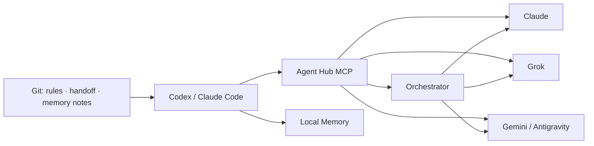

# Agent Hub

Agent Hub는 Codex와 Claude Code에서 Claude, Grok, Gemini를 함께 사용할 수 있도록 만든 개인용 로컬 AI
도구입니다. 간단한 작업은 원하는 모델에 바로 맡길 수 있고, 복잡한 작업은 여러 모델이 초안 작성과 검토를
나눠서 진행할 수 있습니다.

`agent-hub-mcp` 하나를 연결하면 아래 기능을 모두 사용할 수 있습니다.

- Claude, Grok, Google Antigravity(Gemini) 직접 호출
- 여러 모델이 역할을 나눠서 작업하는 오케스트레이션
- Codex와 Claude Code가 함께 사용하는 공통 작업 규칙
- Git으로 관리하는 로컬 메모리와 작업 인계 문서

중요한 정보는 특정 AI 도구 안에만 남기지 않습니다. 규칙, 결정 사항, 진행 상태를 Git에 보관하므로 사용하는
AI 클라이언트가 바뀌어도 저장소에서 작업을 이어갈 수 있습니다.

> 이 프로젝트는 개인 워크플로를 위해 만든 비공식 도구입니다. Anthropic, xAI, Google의 공식 제품이
> 아니며, 각 서비스의 계정과 구독, 사용 정책, 사용량 제한은 직접 확인해야 합니다.

## 구성



| 구성 요소 | 역할 | 현재 제공하는 기능 |
|---|---|---|
| 통합 MCP 서버 | 모델 연결과 오케스트레이션을 한곳에서 처리합니다 | 기본 26개 통합 도구, 단일 stdio 프로세스 |
| Orchestrator | 작업 분배, 모델 선택, 대체 모델 호출, 결과 검토를 돕습니다 | 4개 workflow와 preset, legacy recipe 호환 |
| Claude | 대화, 모델 조회, 로그인과 상태 확인을 제공합니다 | 구독 OAuth 우선, API 키 대체 사용 가능 |
| Grok | 대화, 모델 조회, 로그인과 상태 확인을 제공합니다 | SuperGrok OAuth 우선, API 키 대체 사용 가능 |
| Gemini | 대화, 웹 검색, 글쓰기, 이미지 생성, diff 검토, 릴리스 문서 작성을 제공합니다 | Google Antigravity OAuth |
| 공통 규칙 | 여러 AI 클라이언트에 같은 규칙을 적용합니다 | Ruler 기반 단일 원본 |
| 공통 메모리 | 결정 사항과 교훈을 로컬에서 공유합니다 | basic-memory, FTS 검색 전용 |
| 작업 인계 | 다른 AI 클라이언트에서 중단 지점부터 이어서 작업할 수 있게 합니다 | Markdown + Git |

## 주요 기능

### 모델을 직접 선택해서 사용할 수 있습니다

간단한 질문이나 한 번이면 끝나는 작업은 원하는 모델에 바로 보낼 수 있습니다.

```text
agent_hub_chat에서 provider=claude로 이 설계의 위험을 검토해줘.
agent_hub_chat에서 provider=grok으로 같은 문제를 다른 관점에서 분석해줘.
agent_hub_write로 이 초안을 읽기 쉬운 한국어 문서로 다듬어줘.
```

### 여러 모델이 역할을 나눌 수 있습니다

긴 작업은 한 모델에 모두 맡기지 않고 여러 단계로 나눌 수 있습니다. 예를 들어 Claude가 저장소 구조를
분석하고, Grok이 사용 흐름을 검토한 다음, Gemini가 두 결과를 바탕으로 문서를 작성하도록 구성할 수
있습니다.

두 가지 실행 방식을 제공합니다.

- **단계별 실행:** Codex나 Claude Code가 한 단계씩 모델을 호출하고 결과를 확인합니다. 진행 과정을 직접
  살펴보면서 작업하고 싶을 때 적합합니다.
- **자동 실행:** `agent_hub_run_workflow`가 정해진 workflow를 끝까지 실행합니다. 각 모델에 설정된 동의와 로그인
  검사는 자동 실행 중에도 그대로 적용됩니다.

### AI 클라이언트가 달라도 같은 규칙을 사용합니다

공통 규칙의 원본은 [`instructions/.ruler/`](./instructions/.ruler/)에 있습니다. `scripts/sync.sh`를 실행하면
같은 규칙이 `AGENTS.md`, `CLAUDE.md`, Gemini, Cursor 설정에 반영됩니다.

정보의 종류에 따라 저장 위치를 구분합니다.

- 작업 규칙: `instructions/.ruler/`
- 현재 진행 상태: [`HANDOFF.md`](./HANDOFF.md)
- 장기적으로 기억할 결정과 교훈: [`memory/data/`](./memory/data/)
- 코드와 변경 이력: Git

### 긴 답변이 중간에 잘렸는지 확인합니다

Claude, Grok, Gemini 채팅과 오케스트레이션에는 기본 65,536토큰의 출력 예산이 설정되어 있습니다.
호출할 때 `max_tokens`를 지정하면 해당 값을 우선 사용합니다. Gemini 도구에서는 최대 131,072토큰까지
지정할 수 있습니다.

모델이 출력 한도에 도달해서 답변이 중간에 끊기면 부분 결과를 정상 완료로 처리하지 않습니다.
`success=false`와 `incomplete_finish_reason`을 반환하므로 잘린 문서를 그대로 사용하는 일을 막을 수 있습니다.

## 설치

### 필요한 환경

- Python 3.9 이상
- Node.js와 `npx`: 공통 규칙 동기화에 필요합니다
- `uv` 또는 `uvx`: basic-memory 실행에 필요합니다
- 사용할 모델의 계정과 구독 또는 API 키

현재 설정과 일부 로그인 도구는 macOS를 기준으로 확인했습니다. 핵심 Python 패키지에는 별도의 런타임
의존성이 없지만, 메모리와 규칙 동기화 기능을 사용하려면 위 도구가 필요합니다.

### 1. 저장소 설치

```bash
git clone https://github.com/Meapri/agent-hub.git
cd agent-hub

python3 -m venv .venv
./.venv/bin/pip install -e '.[dev]'
./.venv/bin/pytest -q
```

설치가 끝나면 `.venv/bin/agent-hub-mcp`가 생성됩니다. 일반적으로는 이 통합 서버 하나만 AI 클라이언트에
연결하면 됩니다. provider별 실행 파일은 호환성과 문제 진단을 위해 함께 설치됩니다.

### 2. 현재 기기에 맞게 경로 수정

[`instructions/.ruler/ruler.toml`](./instructions/.ruler/ruler.toml)에는 로컬 절대경로가 들어 있습니다.
아래 세 값을 현재 clone 위치에 맞게 수정해 주세요.

- `BASIC_MEMORY_CONFIG_DIR`
- `BASIC_MEMORY_HOME`
- `mcp_servers.agent-hub.command`

경로를 수정한 뒤 설정을 생성하고 결과를 확인합니다.

```bash
./scripts/sync.sh
./scripts/check-sync.sh
```

생성된 `.mcp.json`과 `.codex/config.toml`에는 다음 두 서버가 등록됩니다.

- `memory`: 로컬 공유 메모리
- `agent-hub`: 모델 연결과 오케스트레이션을 제공하는 통합 서버

AI 클라이언트가 실행 중이었다면 종료 후 다시 열어야 새 MCP 설정이 적용됩니다.

### 3. 사용할 모델에 동의

외부 모델을 호출하려면 provider마다 한 번씩 명시적으로 동의해야 합니다.

```bash
./.venv/bin/claude-codex-consent grant --i-understand-and-consent
./.venv/bin/grok-codex-consent grant --i-understand-and-consent
./.venv/bin/google-antigravity-consent grant --i-understand-and-consent
```

사용하지 않는 provider에는 동의하거나 로그인할 필요가 없습니다. 동의를 취소하려면 `grant` 대신
`revoke`를 사용하면 됩니다.

### 4. 로그인

#### Claude

```bash
claude auth login --claudeai
./.venv/bin/python scripts/claude_codex_login.py mirror-keychain  # macOS
./.venv/bin/python scripts/claude_codex_login.py status
```

Claude Code 구독 OAuth를 우선 사용합니다. `ANTHROPIC_API_KEY`가 설정되어 있으면 API 키도 사용할 수
있습니다.

#### Grok

```bash
./.venv/bin/python scripts/grok_codex_login.py interactive
./.venv/bin/python scripts/grok_codex_login.py status
```

SuperGrok device-code OAuth를 우선 사용합니다. 필요한 경우 `XAI_API_KEY`를 사용할 수 있습니다.

#### Google Antigravity

```bash
./.venv/bin/python scripts/google_antigravity_login.py interactive
./.venv/bin/python scripts/google_antigravity_login.py status
```

브라우저에서 Google OAuth를 마치면 토큰이 사용자의 로컬 설정 디렉터리에 저장됩니다. 토큰은 저장소에
커밋하지 않습니다.

### 5. 설치 상태 확인

```bash
./scripts/doctor.sh
```

이 명령은 공통 규칙의 동기화 상태, Python 패키지, basic-memory, provider별 MCP 실행 파일, 메모리 저장소를
확인합니다. 로그인과 실행 준비 상태는 `agent_hub_status`로 한 번에 확인할 수 있습니다.

## Workflow 사용법

### 단계를 직접 확인하면서 실행

```text
먼저 agent_hub_status와 agent_hub_list_models로 사용할 수 있는 모델을 확인해줘.
그다음 agent_hub_plan_workflow로 실행 단계를 보여주고, 결과는 agent_hub_verify로 확인해줘.
```

실행 순서는 아래와 같습니다.

1. `agent_hub_plan_workflow`로 단계와 사용할 preset을 확인합니다.
2. `agent_hub_start_workflow`로 실행을 시작합니다.
3. 반환된 다음 작업을 실행한 뒤 `agent_hub_continue_workflow`에 결과를 전달합니다.
4. 완료된 문서는 `agent_hub_verify`로 한 번 더 확인합니다.

### Workflow를 자동으로 실행

```text
agent_hub_run_workflow로 deep_readme workflow를 실행해서 이 저장소의 README 초안을 만들어줘.
project_root는 현재 저장소의 절대경로를 사용하고, 모델 호출은 최대 8회로 제한해줘.
```

기본 workflow는 아래 네 가지입니다. 비슷한 작업은 별도 workflow를 복사하지 않고 preset으로 선택합니다.

| Workflow | Preset | 실제 작업 |
|---|---|---|
| `repo_document` | `readme`, `technical-doc`, `proposal` | 저장소 조사, 문서 작성, 검증 |
| `git_document` | `pr-description`, `release-notes` | Git 변경 수집과 변경 문서 작성 |
| `research_brief` | `default` | 웹 검색, 근거 기반 요약, 검증 |
| `deep_readme` | `default` | 여러 모델이 분석과 검토를 나눠 맡는 README 작성 |

번역, 교정, 요약, 이미지 생성처럼 한 번의 모델 호출로 끝나는 기능은 workflow가 아니라
`agent_hub_write`, `agent_hub_generate_image` 같은 직접 도구로 제공합니다. 예전 `research_then_write`는
`research_brief`의 호환 alias로 계속 사용할 수 있습니다.

## 제공하는 도구

기본 `tools/list`에는 아래 26개 통합 도구만 표시됩니다. 모든 도구가 같은 결과 형식을 사용하므로 provider가
달라져도 `success`, `text`, `error`, `usage`, `data`를 같은 방식으로 확인할 수 있습니다.

| 구분 | 개수 | 주요 기능 |
|---|---:|---|
| Provider와 로그인 | 6 | `status`, `list_models`, 로그인 시작·완료·갱신·로그아웃 |
| 직접 작업 | 8 | 대화, 검색, 글쓰기, 이미지, 모델 비교, diff 검토, 릴리스 문서 |
| 설정 | 3 | 모델·transport·profile 설정 조회, 변경, 초기화 |
| Workflow | 9 | 목록, 설명, 계획, 단계 실행, 자동 실행, 결과 검증 |

도구 이름에는 모두 `agent_hub_` prefix가 붙습니다. 예전 60개 `orchestrate_*`, `claude_codex_*`,
`grok_codex_*`, `google_antigravity_*` 이름도 기존 자동화가 깨지지 않도록 계속 호출할 수 있지만 기본 목록에는
표시하지 않습니다.

마이그레이션이나 문제 진단 때문에 예전 목록이 필요하면 서버 환경변수를 바꿀 수 있습니다.

```bash
AGENT_HUB_TOOL_SURFACE=legacy agent-hub-mcp  # 예전 60개만 표시
AGENT_HUB_TOOL_SURFACE=all agent-hub-mcp     # 통합 26개와 예전 60개 모두 표시
```

통합 서버는 legacy MCP 초기화 방식과 stateless modern protocol을 모두 지원합니다. `tools/list`,
`tools/call`, streaming notification, `server/discover`를 서버 하나에서 처리합니다.

## 저장소 구조

```text
agent-hub/
├── src/agent_hub/                 # 통합 MCP 서버와 공통 protocol 코드
├── src/orchestrate_codex/         # 작업 분배, recipe, broker, 결과 검토
├── src/claude_codex/              # Claude 연결
├── src/grok_codex/                # Grok 연결
├── src/google_antigravity_codex/  # Gemini/Antigravity 연결
├── tests/                         # 단위, 통합, protocol 테스트
├── instructions/.ruler/           # 공통 AI 규칙의 원본
├── memory/data/                   # Git으로 관리하는 결정과 교훈
├── handoff/                       # 작업 인계 템플릿과 예시
├── plugins/                       # provider별 플러그인 배포 정보
├── hubs/                          # Codex와 Claude Code 연결 설정
├── scripts/                       # 인증, 동기화, 점검 도구
├── model-access/                  # 통합된 코드의 출처와 실행 근거
├── BUILD-SPEC.md                  # 설계 배경과 원칙
├── EXECUTION-PLAN.md              # 구축 과정과 검증 기록
└── HANDOFF.md                     # 현재 상태와 다음 작업
```

`BUILD-SPEC.md`, `EXECUTION-PLAN.md`, 일부 `hubs/` 문서에는 provider가 별도 저장소였던 통합 이전의 내용도
남아 있습니다. 현재 실행 구조를 확인할 때는 루트 `pyproject.toml`, `src/agent_hub/`, `.mcp.json`을 기준으로
보면 됩니다.

## 보안과 데이터 저장 범위

- **명시적 동의:** 각 provider는 별도의 동의 상태를 확인합니다. 자동 실행도 이 검사를 건너뛰지 못합니다.
- **로그인 정보 분리:** OAuth 토큰과 API 키는 사용자 설정, Keychain, 환경변수에만 보관합니다.
- **로컬 메모리:** 기본 설정에서는 semantic embedding을 끄고 FTS 검색만 사용합니다. 메모리 노트가
  외부 임베딩 API로 전송되지 않습니다.
- **저장소 범위 지정:** diff 검토나 프로젝트 정보 수집에는 대상 저장소의 절대경로를 전달합니다.
- **잘린 출력 거부:** 모델이 토큰 한도에 도달한 결과는 정상 완료로 처리하지 않습니다.
- **호출 횟수 제한:** 자동 workflow와 모델 비교는 여러 번의 외부 호출을 만들 수 있습니다. 작업에 맞게
  `max_leaf_calls`, 모델, 출력 토큰을 제한해 주세요.

provider별 자세한 내용은 [`plugins/`](./plugins/)에서 확인할 수 있습니다. Antigravity의 보안 경계는
[`plugins/antigravity-codex/SECURITY.md`](./plugins/antigravity-codex/SECURITY.md)에 정리되어 있습니다.

## 알아둘 점

- provider의 로그인 방식과 모델 ID는 서비스 변경에 따라 달라질 수 있습니다. `agent_hub_list_models`에서
  `probe=true`로 실제 사용 가능 여부를 확인해 주세요.
- workflow 실행 상태는 메모리와 로컬 파일 저장소에 보관됩니다. 오래 유지해야 하는 결정과 작업 맥락은
  `HANDOFF.md`와 Git에도 함께 기록해 주세요.
- Ruler와 MCP 설정에 절대경로가 포함되어 있습니다. 다른 기기에서 사용할 때는 경로를 수정하고 설정을
  다시 동기화해야 합니다.
- basic-memory는 검색을 돕는 보조 기능입니다. 작업 규칙과 진행 상태, 코드 상태는 각각 원래 저장 위치를
  기준으로 확인해야 합니다.
- 테스트가 통과하더라도 provider의 실시간 로그인 상태, 구독 한도, 응답 품질까지 보장되지는 않습니다.

## 개발과 검증

```bash
./.venv/bin/pytest -q
./scripts/check-sync.sh
./scripts/test-phase1.sh
./scripts/doctor.sh
```

중요한 변경을 할 때는 아래 항목도 함께 확인해 주세요.

1. 기본 `tools/list`에 26개 통합 도구만 표시되는지 확인합니다.
2. 숨겨진 legacy 도구도 기존 이름으로 호출되는지 확인합니다.
3. 모든 `tools/call` 결과가 MCP `content[]`와 공통 output 형식을 지키는지 확인합니다.
4. 자동 실행 중에도 provider별 동의 검사가 유지되는지 확인합니다.
5. legacy와 modern protocol 응답이 모두 유효한지 확인합니다.
6. 생성된 AI 규칙이 원본과 일치하는지 확인합니다.

## 관련 문서

- [`BUILD-SPEC.md`](./BUILD-SPEC.md): 프로젝트를 만든 이유와 설계 원칙
- [`EXECUTION-PLAN.md`](./EXECUTION-PLAN.md): 구축 과정과 검증 기록
- [`HANDOFF.md`](./HANDOFF.md): 현재 상태와 남은 작업
- [`memory/README.md`](./memory/README.md): 로컬 메모리의 저장 위치와 네트워크 사용 범위
- [`model-access/leaves.manifest.json`](./model-access/leaves.manifest.json): 통합된 provider 코드의 출처

## 라이선스

MIT 라이선스를 사용합니다. 통합된 구성요소의 출처와 저작권 정보는 [`NOTICE.md`](./NOTICE.md)에서 확인할
수 있습니다.
