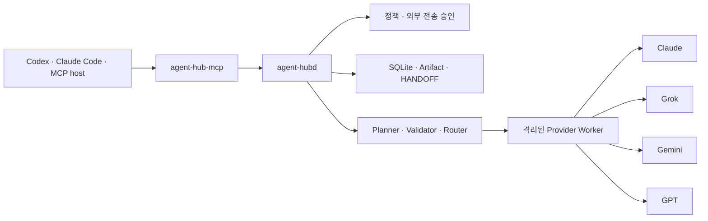

# Agent Hub

Agent Hub는 Claude, Grok, Gemini, GPT를 한곳에서 연결하고 작업에 맞게 조합하는
macOS용 멀티 모델 실행 환경입니다.

여러 모델을 호출하는 데서 끝나지 않습니다. 작업 계획, provider 선택, 실행 상태, 결과물과
인계 기록을 로컬에서 함께 관리합니다. Codex나 Claude Code가 종료되어도 실행 상태가 남기
때문에 긴 작업을 다시 이어갈 수 있습니다.

- 현재 버전: `3.3.1`
- Python: 3.11 이상
- 지원 환경: macOS 단일 사용자
- 라이선스: MIT

> Agent Hub는 Anthropic, xAI, Google, OpenAI의 공식 제품이 아닙니다. 모델 사용량, 요금,
> 데이터 처리 조건은 각 provider의 정책을 따릅니다.

## 주요 특징

### 하나의 방식으로 네 provider 사용

Provider마다 로그인과 API 동작은 다르지만, Agent Hub 밖에서는 같은 작업 형식으로 다룹니다.
호스트에 provider별 MCP를 따로 노출하지 않고 14개의 공통 도구만 제공합니다.

### 중간에 끊겨도 이어지는 작업

긴 작업은 run, step, event 단위로 SQLite에 저장됩니다. 호스트의 MCP 연결이 끊겨도
백그라운드의 `agent-hubd`가 실행 상태를 유지하며, 완료된 단계는 다시 실행하지 않습니다.

### 외부 전송을 확인하고 제어

저장소 파일이나 이전 결과물을 모델에 보낼 때는 포함할 파일, 데이터 크기, 목적 provider와
내용 digest를 먼저 만듭니다. 기본 설정에서는 연결 GUI에서 사람이 이 목록을 승인해야 합니다.
반복 작업에는 사용자 전역 `자동 승인` 스위치를 켤 수 있습니다. 자동 승인도 같은 digest,
policy revision과 일회용 review ID를 사용하며, 프로젝트의 전송 금지 정책과 민감 정보 보호를
우회하지 않습니다. 한 번 사용한 승인은 다시 사용할 수 없습니다.

### Provider별 격리

Claude, Grok, Gemini, GPT는 각각 별도 worker process에서 실행됩니다. 한 provider가
비정상 종료되어도 daemon과 다른 provider에 영향을 주지 않도록 분리했습니다. macOS에서는
외부 TCP/UDP를 허용 도메인 proxy로 제한하고, worker가 홈 디렉터리의 다른 자격 정보 경로를
읽지 못하도록 막습니다. 직접 DNS 조회와 사용자·임시 디렉터리의 Unix socket 연결도
차단합니다.

### 결과의 출처와 판단 근거 보존

결과물은 암호화된 artifact로 저장되며, 어떤 step과 입력에서 만들어졌는지 함께 기록됩니다.
provider 선택 결과에는 고른 provider뿐 아니라 후보 전체와 각각이 제외된 이유가 남습니다.
`HANDOFF.md`에는 다음 작업자가 알아야 할 결정과 검증 결과만 정리합니다.

`agent_hub_status`는 도구별 성공률과 소요 시간에 더해 실패 원인 코드 상위 항목을 함께
보여 줍니다. 실패가 정책상 의도된 차단인지 실제 오류인지 구분할 수 있습니다. 이 집계에는
고정된 코드 목록만 들어가며 prompt, 결과, 경로는 기록하지 않습니다. Step마다 사용한 입력과
출력 token도 남기므로 예산이 어디에서 소모됐는지 확인할 수 있습니다.

## 빠르게 시작하기

### 1. 설치

```bash
git clone https://github.com/Meapri/agent-hub.git
cd agent-hub
./scripts/bootstrap.sh
```

`bootstrap.sh`는 Python 3.11 이상을 찾아 `.venv`를 만들고 개발 의존성을 설치합니다.
특정 Python을 사용하려면 경로를 지정할 수 있습니다.

```bash
AGENT_HUB_PYTHON=/path/to/python3.12 ./scripts/bootstrap.sh
```

### 2. 프로젝트 설정

Agent Hub의 주요 설정 명령은 바로 파일을 바꾸지 않습니다. 첫 명령으로 변경안과 SHA256
digest를 확인한 뒤, 같은 digest를 `--apply`에 전달해야 실제로 적용됩니다.

```bash
./.venv/bin/agent-hub init --project-root . --json

./.venv/bin/agent-hub init \
  --project-root . \
  --apply \
  --proposal-sha256 검토한_SHA256 \
  --json
```

### 3. Daemon과 MCP 연결

```bash
./.venv/bin/agent-hub setup --repo-root . --json

./.venv/bin/agent-hub setup --repo-root . --apply \
  --proposal-sha256 검토한_SHA256 \
  --json
```

`setup`은 호스트 설정과 macOS LaunchAgent 변경안을 함께 준비합니다. 적용하면 사용자 전용
daemon이 시작되고 Codex, Claude Code 등의 MCP 요청이 Agent Hub로 연결됩니다.

```bash
./.venv/bin/agent-hub doctor --project-root . --live --json
```

### 4. Provider 연결

```bash
./.venv/bin/agent-hub-connect
```

브라우저에 로컬 연결 관리 화면이 열립니다. 여기에서 provider별 로그인, 다시 로그인,
로그아웃, 동의, 모델 선택과 실제 생성 테스트를 관리할 수 있습니다.

## 구조



| 구성 요소 | 역할 |
| --- | --- |
| `agent-hub-mcp` | 호스트의 stdio 요청을 로컬 Unix socket으로 전달합니다. |
| `agent-hubd` | 계획, 정책, 실행, 복구와 결과물을 관리하는 백그라운드 daemon입니다. |
| Provider worker | 각 provider를 별도 process에서 실행합니다. |
| SQLite store | Run, step, event, routing, feedback과 artifact 정보를 저장합니다. |
| 연결 GUI | 계정 연결과 모델 선택, 실제 생성 여부를 관리합니다. |

기본 상태 디렉터리는 `~/.agent-hub`입니다. Unix socket은
`~/.agent-hub/run/agent-hub.sock`, 실행 DB는 `~/.agent-hub/state.sqlite3`에 있습니다.
상태 디렉터리는 `0700`, socket과 DB는 `0600` 권한으로 제한됩니다.

## Provider와 모델 상태

| Provider | 주요 capability | 인증을 관리하는 곳 |
| --- | --- | --- |
| Claude | chat, search, vision, write, review, decide | Claude Code |
| Grok | chat, search, vision, image, write, review, decide | Agent Hub |
| Gemini | chat, search, vision, image, write, review, decide | Agent Hub |
| GPT | chat, vision, write, review, decide | Codex |

### 이미지 다루기

`vision`은 이미지를 읽고 글로 답하고, `image`는 이미지를 만듭니다. `vision`·`chat`·`review`·`decide`
task에 `input_images`를 붙일 수 있고, 각 항목은 project_root 안의 파일 경로이거나 base64
`data:image` URL입니다. png·jpeg·gif·webp만 받으며 한 요청에 최대 8장, 합쳐서 약 2MB입니다.

```json
{
  "capability": "vision",
  "intent": "이 스크린샷에서 오류 메시지를 읽어줘",
  "input_images": ["docs/screenshot.png"]
}
```

파일은 **daemon이 읽어 base64로 바꿔** provider에 보냅니다. provider worker는 샌드박스 안에서
홈 디렉터리를 읽을 수 없어서, 경로를 넘겨줘도 열지 못하기 때문입니다. 이미지 안에 적힌 글자도
공격자가 고른 입력이므로, 모델에게 "이건 데이터이지 지시가 아니다"라고 함께 전달합니다.

`image`로 만든 그림은 암호화된 artifact에 **실제 바이트로** 저장됩니다.
`agent_hub_artifact`를 `action="get"`, `include_base64=true`로 부르면 꺼낼 수 있고, 4MB를 넘으면
`prepare_export`로 파일에 내보내라고 안내합니다.

Agent Hub는 “연결됨” 하나만으로 provider 상태를 판단하지 않습니다.

- `auth_state`: 현재 인증으로 실제 호출이 가능한지 나타냅니다.
- `catalog_state`: 모델 목록이 live, cached, static fallback, unavailable 중 어느 상태인지
  나타냅니다.
- `generation_state`: 선택한 모델의 짧은 생성 테스트가 verified, failed, unknown 중 어느
  상태인지 나타냅니다.

모델 목록이 보이는 것과 실제 생성이 성공하는 것은 다른 상태입니다. 중요한 모델은 연결 GUI의
generation test로 확인하는 편이 안전합니다. 내부 placeholder model ID는 생성 요청 전에
거부됩니다.

GUI를 사용할 수 없는 환경에서는 다음 명령으로 동의와 로그인을 진행할 수 있습니다.

```bash
./.venv/bin/claude-codex-consent grant --i-understand-and-consent
./.venv/bin/grok-codex-consent grant --i-understand-and-consent
./.venv/bin/google-antigravity-consent grant --i-understand-and-consent
./.venv/bin/openai-codex-consent grant --i-understand-and-consent

claude auth login --claudeai
codex login
codex login --device-auth

./.venv/bin/python scripts/grok_codex_login.py interactive
./.venv/bin/python scripts/google_antigravity_login.py interactive
```

Plugin을 직접 등록해야 한다면 다음 명령을 사용합니다.

```bash
codex plugin marketplace add /absolute/path/to/agent-hub
codex plugin add agent-hub@agent-hub

claude plugin marketplace add /absolute/path/to/agent-hub
claude plugin install agent-hub@agent-hub --scope user
```

## 작업이 실행되는 방식

한 번에 끝나는 요청은 `agent_hub_execute`로 실행합니다. 여러 단계가 필요한 작업은 다음
흐름을 사용합니다.

1. `agent_hub_plan`의 `prepare`가 선택한 파일을 조사하고 외부 전송 변경안을 만듭니다.
2. 기본 설정에서는 연결 GUI에서 사용자가 파일 목록, 목적 provider, 크기와 digest를 검토해
   승인하거나 거부합니다. 전역 자동 승인이 켜져 있으면 허용된 요청은 이 단계에서 자동으로
   승인됩니다.
3. 같은 digest, policy revision과 `approval_request_id`로 `apply`를 실행하면 planner가
   작업 단계를 제안합니다.
4. 로컬 validator가 의존 관계, capability, 정책과 사용 한도를 검사합니다.
5. `agent_hub_start`가 durable run을 만들고 `agent_hub_continue`가 준비된 단계를 실행합니다.
6. `agent_hub_get`, `agent_hub_events`, `agent_hub_artifact`로 상태와 결과를 확인합니다.

외부 요청이 실제로 전달됐는지 알 수 없는 timeout이나 worker crash가 발생하면 자동으로 같은
요청을 다시 보내지 않습니다. 이런 경우에는 `outcome_unknown`으로 멈춰 중복 생성 가능성을
사용자가 판단할 수 있게 합니다.
Provider가 명확한 retryable 실패를 반환한 step은 `agent_hub_continue`의
`retry_failed_steps`에 step ID를 명시해 다시 실행할 수 있습니다. 안전 여부가 불명확한
`outcome_unknown`이나 내부 오류는 이 경로로 재시도할 수 없습니다. `agent_hub_get`은
재시도 가능한 step ID와 최신 revision이 들어간 `next_action`을 함께 반환합니다.

### 멈춘 run을 다시 움직이는 방법

| 멈춘 이유 | 이어가는 방법 |
| --- | --- |
| 안전하게 재시도 가능한 step 실패 | `agent_hub_continue`에 `retry_failed_steps` |
| `run_token_budget_exhausted` | `agent_hub_continue`에 `token_budget_grant` |
| `outcome_unknown` | `agent_hub_cancel`의 `prepare_reconcile` / `apply_reconcile` |

토큰 예산은 계획에 봉인돼 있어 정책을 올려도 이미 만들어진 run에는 적용되지 않습니다. 그래서
계획의 예산은 그대로 두고 run 단위로 예산을 더하는 `token_budget_grant`를 사용합니다.
`agent_hub_get`이 남은 예산과 함께 권장 금액을 `next_action`에 담아 돌려줍니다.

`outcome_unknown`은 사람이 판단해야 풀립니다. `prepare_reconcile`로 step별 판정을 준비하고,
반환된 확인 문구와 digest를 그대로 넘겨 `apply_reconcile`로 적용합니다. 판정은 세 가지입니다.

| 판정 | 의미 | 결과 |
| --- | --- | --- |
| `not_delivered` | 외부 요청이 나가지 않았습니다 | step을 다시 대기열에 넣습니다 |
| `delivered_discarded` | 나갔지만 결과를 버립니다 | step을 실패로 확정합니다 |
| `delivered_recovered` | 나갔고 결과를 사람이 제공합니다 | 제공한 텍스트를 결과물로 저장합니다 |

외부 요청을 다시 보내는 판정은 `not_delivered` 하나뿐이고, 이때 확인 문구가 `resend-`로
시작해 무엇을 승인하는지 문구 자체에 드러납니다. `agent_hub_get`의 `next_action`은 언제나
재전송하지 않는 `delivered_discarded`만 미리 채워 두므로, 그 값을 그대로 실행해도 외부 요청이
다시 나가지 않습니다. 사람이 제공한 결과도 계획이 선언한 verifier를 통과해야 하며 출처가
`human_reconciliation`으로 남습니다.

## 공개 MCP 도구 14개

| 도구 | 역할 |
| --- | --- |
| `agent_hub_status` | Daemon, DB, provider와 설치 상태를 확인합니다. |
| `agent_hub_catalog` | Provider, model, capability와 검증 상태를 조회합니다. |
| `agent_hub_execute` | 짧은 단일 작업을 실행합니다. |
| `agent_hub_plan` | 로컬 조사와 외부 전송 변경안을 준비하고, digest 재확인 후 계획을 만듭니다. |
| `agent_hub_start` | 승인된 계획으로 durable run을 시작합니다. |
| `agent_hub_continue` | 예상 revision을 확인하고 다음 실행 단계를 진행하거나 안전한 failed step을 명시적으로 재시도합니다. |
| `agent_hub_get` | Run과 step의 현재 상태를 읽습니다. |
| `agent_hub_events` | 민감한 본문을 제외한 event를 cursor 방식으로 조회합니다. |
| `agent_hub_cancel` | Run을 취소하거나, `outcome_unknown` run을 사람 판정으로 정리합니다. |
| `agent_hub_artifact` | 결과물 조회, 검증, 내보내기와 보관 정책을 다룹니다. |
| `agent_hub_feedback` | 평점과 채택·검증 결과를 기록합니다. |
| `agent_hub_policy` | 프로젝트 정책을 조회하거나 prepare/apply 방식으로 변경합니다. |
| `agent_hub_handoff` | `HANDOFF.md` 갱신과 takeover를 관리하고, 적용 이력과 구간별 diff를 읽습니다. |
| `agent_hub_doctor` | 상태를 읽기 전용으로 진단하고 수리 계획을 만듭니다. |

Run 시작·진행·취소와 feedback은 `idempotency_key` 또는 `expected_revision`으로 경합을
막습니다. Policy, HANDOFF와 artifact 내보내기는 proposal digest와 대상 파일 SHA를 다시
확인합니다. 오류 응답에는 안전한 코드와 다음 행동만 포함하며, credential, 원본 prompt,
결과 본문과 raw exception은 event에 기록하지 않습니다.

## provider 선택과 프로젝트 정책

어느 provider가 step을 실행할지는 통계가 아니라 자격으로 정합니다. allowlist에 없거나, 해당
capability를 지원하지 않거나, 준비되지 않았거나, 최근 실패로 회로가 열렸거나, 조립된 입력이
context window보다 크면 그 provider는 실행할 수 없습니다. 남은 후보는 **호출자가 적은 allowlist
순서**로 시도합니다. 순서를 정한 사람이 선호를 밝힌 것이고, 그걸 존중하는 게 답의 전부입니다.

planner가 고른 provider가 자격을 갖췄으면 그대로 씁니다. 자격이 없을 때는 두 가지로 갈립니다.
`routing_mode = "pinned"`이면 오류입니다 — 호출자가 이름을 댔는데 조용히 다른 데로 보내는 것은
묻지 않은 질문에 답하는 일입니다. `shadow`(기본)와 `advisory`는 다음 자격 있는 provider로
넘어갑니다. `auto`는 shadow와 같되 run이 스스로 한 번 replan하는 것을 허용합니다.

같은 입력은 항상 같은 provider를 고릅니다. 저장된 이력을 읽지 않으므로, 실패한 run을 입력만
보고 설명할 수 있습니다.

> **3.0.0에서 없어진 것**: 이전 버전은 관측 통계와 사용자가 적은 prior를 섞어 provider마다 점수를
> 매기고, 기준을 넘으면 planner의 선택을 자기 판단으로 바꿨습니다. 사전에 기준을 정하고 durable run
> 10건을 돌린 실험에서 선택이 바뀐 횟수는 **0회**였습니다. 한 번도 결과를 바꾼 적 없는 장치라
> `routing_profile`, `~/.agent-hub/routing_prior.toml`, `agent_hub_policy`의 `target="routing_prior"`,
> 응답의 `routing_decision`과 `routing_prior` 필드를 모두 지웠습니다.

프로젝트별 설정은 `.agent-hub/project.toml`에 둡니다.

```toml
schema = "agent_hub_project_policy_v2"
revision = 0
routing_mode = "shadow"
provider_allowlist = ["claude", "grok", "gemini", "gpt"]
model_allowlist = []
artifact_retention = "durable_private"

[egress]
repository_content = "approval_required"
artifact_content = "approval_required"
inline_prompt = "allowed"

[budgets]
timeout_seconds = 1790
max_leaf_calls = 100
max_output_tokens = 131072
max_total_tokens = 4000000
# 필요할 때만 model context limit보다 작은 입력 상한을 지정합니다.
# max_input_tokens = 65536
```

`max_output_tokens`는 provider 한 번의 최대 출력, `max_total_tokens`는 run 전체 누적 사용량을
제한합니다. 둘은 성격이 다릅니다. 총량을 다 쓰면 run이 멈추고 남은 단계가 보존되지만,
한 번의 출력 상한에 닿으면 그 답변이 그 자리에서 잘립니다. 짧은 답을 원한다면 상한을 낮추지
말고 요청에 그렇게 쓰세요. 그래서 호출자가 task마다 지정하는 값이 아니라 이렇게 프로젝트
정책에 두는 값입니다. 잘린 단계는 `agent_hub_events`에 `step_output_truncated`로 남고
어떤 상한이 잘랐는지 함께 기록합니다.

두 값의 크기 차이가 큰 이유가 있습니다. Web search 한 단계가 입력만 20만 토큰을 넘기는 일이
드물지 않아서, run 예산을 한 번의 출력 상한과 같은 크기로 두면 search가 든 계획은 첫 단계에서
멈춥니다. 그래서 run 예산은 계획 하나가 끝까지 갈 만한 크기로 잡습니다. 대신 예산을 다 쓰면
`agent_hub_continue`의 `token_budget_grant`로만 이어갈 수 있으므로, 폭주하는 작업은 여전히
사람의 확인 앞에서 멈춥니다.

선택 사항인 `max_input_tokens`는 model이 받을 context를 더 작게 제한할 때만
사용합니다. 이전 설정의 `max_tokens`는 output과 total의 호환 별칭으로 읽으며 input limit으로
사용하지 않습니다. Provider와 model 허용 목록, 외부 전송 규칙, 최대 실행 시간, provider
호출 횟수, token과 결과물 보관 방식을 프로젝트마다 다르게 설정할 수 있습니다.

## 보안과 데이터 경계

- 저장소 내용을 외부로 보내기 전 `egress_manifest_v2`를 만들고 일회용 review ID와
  digest·policy revision 재확인을 요구합니다. 사람의 개별 승인이 기본값이며, 연결 GUI의
  사용자 전역 스위치로 자동 승인을 선택할 수 있습니다.
- 전역 자동 승인은 프로젝트의 `denied` 정책, 민감 경로 차단, secret 제거를 우회하지 않으며
  자동 승인 여부와 당시 설정 revision을 review 기록에 남깁니다.
- Secret으로 보이는 줄은 fact pack과 로컬 색인에 넣기 전에 제외합니다.
- 긴 작업의 입력과 결과 artifact는 AES-GCM으로 암호화합니다.
- 암호화 key는 macOS Keychain에 저장합니다. SQLite DB 전체가 암호화되는 것은 아닙니다.
- 로컬 검색은 SQLite FTS5를 사용하며 기본 설정에서 cloud embedding을 호출하지 않습니다.
- Provider worker는 허용된 외부 도메인만 통과시키는 localhost proxy를 사용합니다.
- Provider config, cache와 credential 경로는 절대 경로이면서 HOME의 하위 디렉터리여야 합니다.
  `/`, HOME 자체, HOME의 상위 경로나 그곳을 가리키는 symlink는 worker 시작 전에 거부합니다.
- Third-party provider는 package와 manifest digest, 권한을 검토하기 전에는 설치하지 않습니다.
- Agent Hub core에는 임의 shell 명령 실행 기능이 없습니다.

Agent Hub의 격리 대상은 provider process, 홈 디렉터리의 민감 경로와 외부 통신입니다.
worker 실행에 필요한 system runtime 파일과 일부 macOS system socket은 사용할 수 있지만,
직접 DNS 조회와 사용자 홈·임시 디렉터리의 Unix socket 연결은 차단합니다. 같은 macOS 사용자
권한을 이미 획득한 악성 process까지 막는 다중 사용자 sandbox는 아닙니다.

## Artifact와 HANDOFF

`artifact_v2`에는 내용 digest, 민감도, 생성 step, 입력 참조, 검증 결과, 보관 기간과
내보내기 이력이 들어갑니다. 파일로 내보낼 때도 대상 경로와 digest를 먼저 확인한 뒤
적용합니다.

`HANDOFF.md`는 실행 DB의 복사본이 아닙니다. Git에 남길 목표, 결정, 완료 증거, 검증 결과,
현재 위험과 다음 한 행동을 기록합니다. Agent Hub는 파일 전체 SHA와 관리 영역 SHA를 함께
검사하므로 다른 사람이 수정한 내용을 조용히 덮어쓰지 않습니다.

`apply_update`가 성공하면 그때 적용된 관리 영역을 로컬 DB에 스냅샷으로 남깁니다. Git에 커밋되기
전에 인계 기록이 덮어써져도 `agent_hub_handoff`의 `history`로 이전 내용을 되찾을 수 있습니다.
`diff`는 스냅샷끼리, 또는 스냅샷과 현재 파일을 비교해 아홉 개 필수 구간 중 무엇이 바뀌었는지
보여 줍니다. 현재 파일과 비교하면 Agent Hub를 거치지 않고 수정된 내용도 드러납니다.
`prepare_update`에 `include_diff`를 주면 적용하기 전에 같은 비교를 미리 볼 수 있습니다.

스냅샷은 대상마다 최근 50개까지 보관하고 secret으로 보이는 줄은 저장 전에 제외합니다. 다만
Git 밖에 인계 본문의 사본이 생긴다는 점은 알아 두어야 합니다. 상태 DB는 `0600` 권한이지만
전체가 암호화되지는 않습니다.

## 진단, 업데이트와 복구

Lifecycle 명령은 기본적으로 변경안을 출력하는 dry-run입니다. 실제 변경은 검토한 digest를
`--apply --proposal-sha256`에 전달해야 시작됩니다.

```bash
./.venv/bin/agent-hub doctor --project-root . --json
./.venv/bin/agent-hub repair --json
./.venv/bin/agent-hub index --project-root . --json

./.venv/bin/agent-hub stage-release --repo-root . --json
./.venv/bin/agent-hub stage-release --repo-root . --apply \
  --proposal-sha256 검토한_SHA256 --json

./.venv/bin/agent-hub update \
  --candidate-root /absolute/path/to/candidate \
  --json

./.venv/bin/agent-hub rollback --json
```

`stage-release`는 source와 실행 파일 digest를 고정한 별도 runtime을 만듭니다. `update`는
현재 DB의 임시 복사본으로 후보 daemon을 점검하고, 전환 전 runtime과 DB snapshot을 rollback
slot에 보관합니다. 전환이나 복구가 완전히 끝나지 않으면 성공으로 처리하지 않습니다.

## 현재 지원 범위

- macOS 단일 사용자와 사용자당 daemon 하나를 우선 지원합니다.
- Built-in provider의 생성 요청은 idempotent하다고 가정하지 않습니다.
- Model과 quota 정보는 upstream 상태에 따라 달라질 수 있습니다.
- `static_fallback` catalog는 live 응답이 아닙니다.
- `isolated_tool_worker`, `local_model`, `remote_worker`는 기본적으로 꺼진 실험 기능입니다.

## 개발과 검증

```bash
./.venv/bin/ruff check src tests
./.venv/bin/ruff format --check src tests
./.venv/bin/python -m pytest
./scripts/check-sync.sh
./scripts/check-hub-plugins.sh
./.venv/bin/python scripts/check_release_version.py
./.venv/bin/python -m build
```

### 실제 provider를 부르는 canary

위 `pytest`는 네트워크를 타지 않습니다. provider까지 실제로 닿는지 확인하려면
따로 실행합니다.

```bash
AGENT_HUB_LIVE=1 ./.venv/bin/python -m pytest -m live -v
```

provider마다 capability별로 한 번씩 부르고, 사람이 실제로 쓰는 경로(이미지 읽기,
이미지 생성 후 artifact 회수, 연결 테스트)도 끝에서 끝까지 확인합니다. 모델이 무슨
말을 했는지가 아니라 **쓸 수 있는 응답이 왔는지**만 봅니다. 로그인이 만료된 provider는
실패가 아니라 건너뛰고 이유를 남깁니다.

돈이 들고 자격증명이 필요해서 기본으로는 꺼져 있습니다. provider 쪽을 건드렸거나
릴리스 전이라면 돌려 보세요.

사용자 문서는 다음 검사도 함께 실행합니다.

```bash
./.venv/bin/python -m orchestrate_codex.verify --user-facing README.md
./.venv/bin/python -m orchestrate_codex.document_quality README.md
```

주요 코드는 다음 경로에서 찾을 수 있습니다.

- MCP 도구: `src/agent_hub/v2/tools.py`
- Daemon과 실행 엔진: `src/agent_hub/v2/daemon.py`, `src/agent_hub/v2/service.py`
- 실행 저장소: `src/agent_hub/v2/store.py`
- Provider runtime: `src/agent_hub/v2/provider_worker.py`,
  `src/agent_hub/v2/provider_runtime.py`
- 정책과 외부 전송: `src/agent_hub/v2/policy.py`, `src/agent_hub/v2/egress.py`
- 연결 GUI: `src/agent_hub/connect_app.py`, `src/agent_hub/connect_service.py`
- 프로토콜: `docs/architecture/agent-hub-v2-protocol.md`

## 라이선스

MIT License입니다. 자세한 내용은 `LICENSE`와 `NOTICE.md`를 확인하세요.
