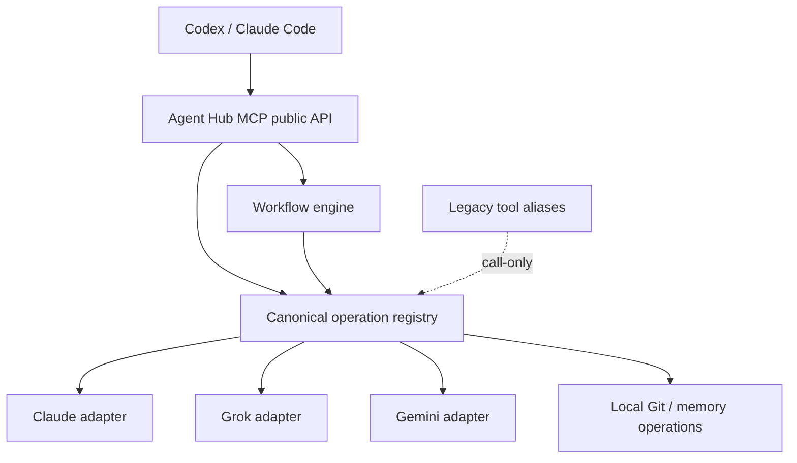

# Agent Hub 도구·워크플로 통합 재설계 검토 기록

검토 기준: `80a6125` (`main`, 2026-07-17)

## 구현 결과

이 문서 아래의 분석은 재설계 전 상태를 기록한 내용입니다. 당시 제안했던 legacy 호환 계층은 최종 구현에서
제거했으며, 아래의 호환·단계별 이전 제안은 현재 사용법이 아니라 과거 검토 기록입니다.

- 기본 `tools/list`를 60개 provider별 도구에서 26개 `agent_hub_*` 통합 도구로 바꿨습니다.
- 기존 60개 이름과 `AGENT_HUB_TOOL_SURFACE` 호환 계층을 제거했습니다.
- 통합 서버의 목록과 호출 registry에는 26개 `agent_hub_*` 도구만 남겼습니다.
- 상태, 모델 목록, 로그인, 대화, Gemini 전용 작업, 설정, workflow를 공통 결과 형식으로 묶었습니다.
- 21개 recipe를 새 API에서는 4개 workflow와 preset으로 정리했습니다.
- `research_then_write` alias와 옛 recipe ID를 workflow로 받던 호환 경로도 제거했습니다.
- 목록에만 있던 Grok 로그인 도구 4개의 실행 경로를 연결했습니다.
- 모든 공개 도구의 handler, metadata, output schema를 검사하고 제거한 이름이 거부되는지 테스트합니다.
- 실제 통합 `agent_hub_chat` 경로로 Claude, Grok, Gemini의 짧은 live smoke를 실행했고 세 provider 모두
  성공했습니다. Gemini 결과가 한 번 더 감싸지던 문제와 비탐색 상태의 readiness 판정도 이 과정에서 찾아
  수정했습니다.
- 전체 테스트, 규칙 동기화, disposable fixture 수용 테스트와 Python 패키지 빌드를 함께 확인했습니다.

live smoke는 짧은 대화 경로만 확인합니다. 검색, 이미지 생성, diff 검토처럼 비용과 부작용 범위가 다른
기능의 실제 호출 품질까지 보장하지는 않습니다.

## 결론

검토 당시 Agent Hub는 여러 저장소를 하나의 Python 프로젝트와 하나의 MCP 서버로 합치는 데는 성공했지만,
외부에 보이는 도구와 recipe는 통합 전 플러그인 구조를 대부분 그대로 유지하고 있었습니다.

즉, 아래 내용은 **실행 서버만 통합되어 있고 사용자 API 통합은 끝나지 않았던 기준점**을 설명합니다.

이번 검토에서 확인한 핵심 내용은 아래와 같습니다.

- 통합 서버가 공개하는 도구는 60개입니다.
- provider별 상태 확인, 로그인, 모델 조회 도구가 비슷한 형태로 반복됩니다.
- Claude와 Grok의 채팅 도구는 입력 스키마가 완전히 같습니다.
- 21개 recipe 중 13개는 기존 도구를 한 번 호출하는 구조입니다.
- 21개 recipe는 실제로 10가지 단계 모양만 사용합니다.
- `research_brief`와 `research_then_write`는 설명과 실행 단계가 완전히 같습니다.
- Grok 로그인 관련 도구 4개는 목록에는 나오지만 실제 호출 경로가 연결되어 있지 않습니다.
- 통합 서버와 맞지 않는 과거 설명과 진단 경로가 일부 남아 있습니다.

큰 기능을 한 번에 갈아엎기보다는 먼저 실행 오류를 고친 뒤, 내부 공통 계층을 만들고, 마지막에 새로운
통합 도구를 공개하는 순서가 안전합니다.

## 검토 방법

이번 검토에서는 이름만 비교하지 않았습니다. 각 도구와 recipe에 대해 다음 항목을 확인했습니다.

- MCP에 공개되는 이름과 설명
- 입력 스키마의 필드와 필수값
- 실제 dispatch 함수 연결 여부
- 반환 형식과 MCP metadata
- 파일, 인증 정보, Git 상태를 변경하는지 여부
- recipe의 단계 수와 각 단계가 호출하는 capability
- 통합 서버에서 호출할 때 provider adapter를 거치는 실제 경로
- 현재 테스트가 확인하는 범위와 빠진 범위

## 현재 구조

### 도구 수

| 영역 | 도구 수 | 특징 |
|---|---:|---|
| Orchestrator | 15 | 서로 다른 시기에 추가된 실행 방식이 함께 노출됩니다 |
| Claude | 8 | 대화, 모델 조회, 상태와 로그인 도구를 제공합니다 |
| Grok | 9 | Claude와 구조가 비슷하며 로그인 도구 4개는 현재 실행되지 않습니다 |
| Gemini/Antigravity | 28 | 대화 외에도 검색, 글쓰기, 이미지, 설정, Git 작업을 제공합니다 |
| 합계 | 60 | 모든 옛 도구 이름을 그대로 합친 숫자입니다 |

### Recipe 수

| 구분 | 개수 | 설명 |
|---|---:|---|
| 전체 recipe | 21 | 현재 MCP prompt와 Orchestrator에서 노출됩니다 |
| 한 단계 recipe | 13 | 대부분 기존 도구를 한 번 감싼 형태입니다 |
| 두 단계 이상 recipe | 8 | 실제 작업 흐름에 가까운 항목입니다 |
| 서로 다른 단계 모양 | 10 | 이름은 21개지만 실행 구조는 10개입니다 |

## 우선 고쳐야 하는 문제

### P0. Grok 로그인 도구가 목록에만 존재합니다

다음 도구는 `tool_definitions()`에는 있지만 `dispatch_tool()`의 실행 표에는 없습니다.

- `grok_codex_login_status`
- `grok_codex_login_start`
- `grok_codex_login_complete`
- `grok_codex_logout`

통합 서버에서 `grok_codex_login_status` 등을 호출하면 `unknown tool` 오류가 발생합니다. 현재 테스트는 도구가
목록에 있는지와 올바른 adapter에 배정되는지만 확인해서 이 문제를 발견하지 못합니다.

이 문제는 재설계와 별개로 먼저 수정해야 합니다. 앞으로는 **목록에 공개된 모든 도구가 실제 handler까지
연결되는지 검사하는 contract test**가 필요합니다.

### P1. 통합 서버와 설명이 맞지 않는 부분이 있습니다

`orchestrate_run`은 통합 서버에서 같은 프로세스의 provider adapter를 사용합니다. 하지만 도구 설명에는
여전히 별도의 leaf MCP를 실행하고 `leaves.json`이 필요하다고 적혀 있습니다.

`orchestrate_probe_models`와 `orchestrate_check_leaves`는 실제로 옛 `leaves.json` 기반 subprocess 경로를
사용합니다. 통합 실행 경로와 진단 경로가 서로 달라서 상태 확인 결과가 실제 실행 상태를 제대로 설명하지
못할 수 있습니다.

`orchestrate_get_run` 설명에는 같은 프로세스에서만 상태를 읽을 수 있다고 적혀 있지만, 현재 코드는 실행
상태를 `~/.orchestrate_codex/runs/`에 저장하고 재시작 후에도 다시 불러옵니다.

### P1. 테스트가 기존 중복 구조를 정상 상태로 고정하고 있습니다

현재 통합 테스트는 아래 조건을 중요하게 확인합니다.

- 네 패키지의 도구 목록을 합친 결과와 통합 서버 목록이 같은가
- 전체 도구 수가 각 패키지 도구 수의 합과 같은가
- 기존 이름이 그대로 유지되는가

통합 초기에는 필요한 테스트였지만, 이제는 도구를 정리하려고 할 때 오히려 기존 중복을 그대로 유지하도록
만듭니다. 다음 단계에서는 “옛 목록과 같은가”보다 “통합 계약을 만족하는가”를 확인해야 합니다.

## 중복과 역할 충돌

### 1. 상태 확인 도구가 너무 잘게 나뉘어 있습니다

아래 14개 도구는 세부 정보는 다르지만 사용자가 알고 싶은 내용은 대부분 같습니다.

- Claude: `consent_status`, `provider_status`, `login_status`, `doctor`
- Grok: `consent_status`, `provider_status`, `login_status`, `doctor`
- Gemini: `consent_status`, `provider_status`, `agy_auth_status`, `login_status`, `whoami`, `quota_status`

사용자가 실제로 알고 싶은 것은 보통 아래 다섯 가지입니다.

- 이 provider를 사용하도록 동의했는가
- 로그인되어 있는가
- 지금 호출할 수 있는가
- 어떤 계정과 기본 모델을 사용하는가
- 별도의 경고나 사용량 제한 정보가 있는가

이 정보는 `agent_hub_status` 하나에서 provider별로 묶어서 보여주는 편이 이해하기 쉽습니다.

### 2. Claude와 Grok의 공통 코드가 반복됩니다

두 provider의 아래 부분은 같은 구조입니다.

- 채팅 입력 스키마
- 모델 목록 입력 스키마
- consent 상태 도구
- provider 상태 도구
- doctor 결과 구성
- MCP 초기화와 `tools/list`, `tools/call` 처리

provider마다 달라야 하는 부분은 인증 방식, API 요청, 기본 모델, 응답 해석입니다. 공통 MCP 스키마와 상태
응답은 `agent_hub`의 공통 operation 계층으로 올리고, provider 코드는 실제 API 차이만 처리하는 편이
좋습니다.

### 3. 모델 조회와 모델 선택이 여러 곳에 있습니다

현재 모델 관련 기능은 다음 위치에 나뉘어 있습니다.

- Claude, Grok, Gemini의 `list_models`
- `orchestrate_probe_models`
- `google_antigravity_route_model`
- Gemini의 모델 preference와 profile 도구
- Orchestrator의 고정 모델 catalog와 fallback chain

모델 목록과 실제 사용 가능 여부는 `agent_hub_list_models(provider, probe)`로 모으는 편이 좋습니다. 자동 모델
선택은 별도 공개 도구로 유지하기보다 `agent_hub_chat(provider="auto")`와 workflow routing에서 같은 정책을
사용해야 합니다.

### 4. 오케스트레이션 진입점이 세 갈래로 겹칩니다

현재는 다음 방식이 함께 노출됩니다.

1. `plan_recipe → start_run → continue_recipe → get_run`
2. `advise → step → leaf 호출 → verify`
3. `run`으로 전체 자동 실행

세 방식 모두 쓸 이유는 있지만 이름과 역할이 한눈에 구분되지 않습니다. 특히 `advise`,
`resolve_bindings`, `fallback_chains`, `check_leaves`, `probe_models`는 모두 “지금 어떤 provider를 어떻게 쓸 수
있는가”를 조금씩 다른 방식으로 설명합니다.

새 구조에서는 사용 방법을 아래 세 가지로 명확히 나누는 편이 좋습니다.

- **직접 실행:** 원하는 operation과 provider를 바로 호출합니다.
- **한 번 위임:** Agent Hub가 한 작업에 맞는 provider와 입력을 준비합니다.
- **workflow 실행:** 여러 단계를 직접 진행하거나 자동으로 끝까지 실행합니다.

### 5. 결과 형식과 MCP metadata가 provider마다 다릅니다

Gemini의 28개 도구에는 `title`, `annotations`, `outputSchema`가 있습니다. 나머지 32개 도구에는 이 정보가
없습니다. 같은 통합 서버 안에서도 클라이언트가 도구의 읽기 전용 여부, 외부 네트워크 사용 여부, 반환값을
일관되게 판단할 수 없습니다.

결과 payload도 provider별 필드가 다릅니다. 통합 operation은 최소한 아래 공통 필드를 보장해야 합니다.

```json
{
  "success": true,
  "operation": "chat",
  "provider": "claude",
  "model": "...",
  "text": "...",
  "finish_reason": "stop",
  "usage": {},
  "warnings": [],
  "error": null,
  "artifacts": []
}
```

provider 고유 응답이 필요하면 `provider_data` 아래에 보관하고, MCP 바깥쪽 응답은 항상 `content[]`와
`isError`를 같은 기준으로 구성해야 합니다.

## Recipe 감사 결과

### 완전히 같은 recipe

`research_brief`와 `research_then_write`는 이름만 다르고 아래 내용이 모두 같습니다.

- 설명
- `doc_class`
- 검색 단계
- 작성 단계
- 각 단계의 binding과 `write_task`

`research_brief`를 정식 이름으로 남기고 `research_then_write`는 호환 alias로 처리하는 편이 좋습니다.

### 이름만 다르고 같은 템플릿을 사용하는 recipe

다음 recipe는 실행 구조가 같고 작성 종류만 다릅니다.

| 공통 템플릿 | 현재 recipe | 달라지는 값 |
|---|---|---|
| 저장소 정보 수집 → 문서 작성 → 검증 | `durable_readme`, `technical_doc`, `proposal` | `write_task` |
| Git 정보 수집 → 문서 작성 | `change_pr`, `release_notes` | `write_task` |
| 한 번의 글쓰기 호출 | `translate_doc`, `polish_text`, `rewrite_text`, `summarize_text`, `announcement`, `blog_post`, `email_draft`, `product_copy` | `write_task` |

앞의 두 그룹은 실제 다단계 workflow로 유지할 가치가 있습니다. 다만 같은 단계 목록을 여러 번 복사하지
말고 하나의 템플릿과 여러 preset으로 표현해야 합니다.

한 번의 글쓰기 호출로 끝나는 세 번째 그룹은 workflow가 아니라 `agent_hub_write(task=...)`의 preset으로
분류하는 편이 맞습니다.

### 기존 도구를 한 번 감싼 recipe

아래 recipe는 실행 단계가 하나뿐이고 이미 같은 기능의 도구가 있습니다.

| Recipe | 실제 호출 기능 | 권장 처리 |
|---|---|---|
| `direct_chat` | 채팅 | 직접 operation 사용 |
| `generate_image` | 이미지 생성 | 직접 operation 사용 |
| `compare_models` | 모델 비교 | 직접 operation 사용 |
| `review_diff` | diff 검토 | 직접 operation 사용 |
| `release_draft` | 릴리스 문서 생성 | 직접 operation 사용 |

이 이름들은 기존 호출 호환을 위해 alias로 받을 수 있지만, 새 workflow 목록에는 보여주지 않는 편이
좋습니다.

### 실제 workflow로 남길 구조

중복을 템플릿과 preset으로 정리하면 실제 다단계 workflow는 네 가지 구조로 줄일 수 있습니다.

1. `repo_document`
   - 저장소의 오래 유지되는 정보를 수집합니다.
   - 문서를 작성합니다.
   - 결과가 현재 세션 일지처럼 쓰이지 않았는지 검사합니다.
   - preset: README, 기술 문서, 제안서

2. `git_document`
   - Git 변경 사항을 수집합니다.
   - 변경 기반 문서를 작성합니다.
   - preset: PR 설명, 릴리스 노트

3. `research_brief`
   - 근거가 필요한 내용을 검색합니다.
   - 검색 결과를 바탕으로 출처가 있는 문서를 작성합니다.

4. `deep_readme`
   - 저장소와 코드를 수집합니다.
   - 두 모델이 구조와 사용법을 각각 분석합니다.
   - 다른 모델이 결과를 합쳐 README를 작성합니다.
   - 마지막으로 문서를 검사합니다.

## 합치면 안 되는 기능

이름이 비슷하다고 모두 하나로 합치면 오히려 사용하기 어려워집니다.

### 채팅과 글쓰기는 구분해야 합니다

`chat`은 provider의 기본 생성 기능입니다. `write`는 번역, 요약, 문체, 독자, 저장소 정보 사용 여부 같은
문서 작성 규칙을 적용합니다. 내부에서는 같은 모델 API를 사용할 수 있지만 외부 operation은 구분하는 편이
명확합니다.

### 로그인 과정은 공통 이름을 쓰되 provider 차이를 보존해야 합니다

Grok은 device-code 방식이고 Gemini는 PKCE redirect를 사용합니다. Claude는 외부 Claude CLI와 macOS
Keychain을 사용할 수 있습니다. `auth_start`, `auth_complete`, `auth_refresh`, `auth_logout`이라는 공통 수명
주기는 사용할 수 있지만, 실제 단계와 `next_action`은 provider adapter가 결정해야 합니다.

### 릴리스 정보 수집과 문서 작성은 구분해야 합니다

`release_snapshot`은 로컬 Git 정보를 읽는 작업이고 `release_draft`는 모델을 호출해 글을 만드는 작업입니다.
네트워크 사용과 비용, 실패 원인이 다르므로 두 operation을 따로 유지하는 편이 안전합니다.

## 권장 구조



각 계층의 책임은 아래처럼 나눕니다.

1. **MCP public API**
   - 사용자가 실제로 선택하는 도구만 공개합니다.
   - 공통 입력과 출력 형식을 보장합니다.

2. **Canonical operation registry**
   - `chat`, `write`, `search`, `image` 같은 기능 단위로 provider를 연결합니다.
   - provider 선택, 지원 capability, fallback을 한곳에서 관리합니다.

3. **Provider adapter**
   - 로그인, HTTP 요청, 모델별 옵션, provider 응답 해석만 담당합니다.
   - MCP 도구 목록을 provider마다 다시 만들지 않습니다.

4. **Workflow engine**
   - 여러 operation을 순서대로 실행합니다.
   - workflow 템플릿과 preset을 구분합니다.

5. **Legacy alias**
   - 기존 이름의 호출은 당분간 받습니다.
   - 새 클라이언트의 `tools/list`에는 보여주지 않습니다.

## 권장 공개 도구

아래 목록은 구현 전에 스키마 spike로 최종 확인해야 하는 초안입니다. 현재 60개를 약 26개의 통합 도구로
줄일 수 있습니다.

### Provider와 인증

| 새 도구 | 역할 |
|---|---|
| `agent_hub_status` | 모든 provider의 동의, 로그인, 준비 상태, 계정, 기본 모델, 경고를 모아서 보여줍니다 |
| `agent_hub_list_models` | provider별 모델을 조회하고 선택적으로 실제 호출 가능 여부를 확인합니다 |
| `agent_hub_auth_start` | provider에 맞는 로그인 시작 단계와 다음 행동을 반환합니다 |
| `agent_hub_auth_complete` | browser redirect 또는 device-code 로그인을 완료합니다 |
| `agent_hub_auth_refresh` | 지원하는 provider의 토큰을 갱신합니다 |
| `agent_hub_auth_logout` | 선택한 provider의 로컬 토큰을 삭제합니다 |

Claude의 `mirror_keychain`처럼 특정 운영체제에만 필요한 기능은 기본 도구 목록에 넣지 않고 CLI 또는 숨겨진
고급 도구로 유지합니다.

### 직접 operation

| 새 도구 | 역할 |
|---|---|
| `agent_hub_chat` | `provider=auto|claude|grok|gemini`로 대화합니다 |
| `agent_hub_search` | 근거가 필요한 검색을 실행합니다 |
| `agent_hub_write` | 번역, 요약, 교정, 문서 작성을 처리합니다 |
| `agent_hub_generate_image` | 이미지를 생성합니다 |
| `agent_hub_compare_models` | 같은 입력을 여러 모델에서 비교합니다 |
| `agent_hub_review_diff` | 저장소의 diff를 검토합니다 |
| `agent_hub_release_snapshot` | 로컬 Git 릴리스 정보를 수집합니다 |
| `agent_hub_release_draft` | 수집한 정보를 바탕으로 릴리스 문서를 작성합니다 |

현재 일부 operation이 Gemini에서만 실행되더라도 이름은 provider와 분리합니다. 나중에 다른 provider가 같은
기능을 지원할 때 공개 API를 다시 바꾸지 않아도 됩니다.

### 설정

| 새 도구 | 역할 |
|---|---|
| `agent_hub_get_settings` | 모델 preference, provider 선택, profile을 함께 조회합니다 |
| `agent_hub_update_settings` | 필요한 설정만 부분적으로 변경합니다 |
| `agent_hub_reset_settings` | task, provider 또는 전체 범위의 설정을 초기화합니다 |

### Workflow와 위임

| 새 도구 | 역할 |
|---|---|
| `agent_hub_list_workflows` | 실제 다단계 workflow와 preset을 구분해서 보여줍니다 |
| `agent_hub_get_workflow` | 단계, 필요한 capability, context 정책을 설명합니다 |
| `agent_hub_plan_workflow` | 실행하지 않고 실제 provider와 입력까지 포함한 계획을 만듭니다 |
| `agent_hub_start_workflow` | 사용자가 단계를 확인하는 workflow를 시작합니다 |
| `agent_hub_continue_workflow` | 외부 호출 결과를 받아 다음 단계로 진행합니다 |
| `agent_hub_get_run` | 저장된 실행 상태를 불러옵니다 |
| `agent_hub_run_workflow` | workflow를 자동으로 끝까지 실행합니다 |
| `agent_hub_delegate` | 한 작업에 맞는 provider 호출 하나를 준비합니다 |
| `agent_hub_verify` | 만들어진 결과를 context 정책에 맞게 검사합니다 |

이 초안은 26개입니다. 기존 60개보다 34개 적고, 클라이언트가 읽어야 하는 도구 설명도 약 57% 줄어듭니다.

## 검토 당시 호환안 (최종 미적용)

> 아래 호환안은 구현 후 제거했습니다. 현재 통합 서버는 26개 `agent_hub_*` 도구만 등록하며, 옛 이름을
> 직접 호출하면 `unknown tool` 오류를 반환합니다.

새 도구와 기존 도구를 모두 `tools/list`에 노출하면 일시적으로 도구 수가 더 늘어납니다. 아래 방식이 더
안전합니다.

1. 기존 이름과 새 이름을 모두 실행 registry에 등록합니다.
2. `tools/list`에는 새 통합 도구만 보여줍니다.
3. 기존 이름을 직접 호출하면 같은 canonical operation으로 전달합니다.
4. legacy 호출 결과에 `deprecated_tool`과 대체 도구 이름을 warning으로 넣습니다.
5. 환경변수로 공개 범위를 선택할 수 있게 합니다.

```text
AGENT_HUB_TOOL_SURFACE=unified   # 새 도구만 목록에 표시, 권장값
AGENT_HUB_TOOL_SURFACE=legacy    # 기존 클라이언트 문제 해결용
AGENT_HUB_TOOL_SURFACE=all       # 개발과 이전 검증용
```

최소 한 번의 minor release 동안 기존 이름은 `call-only` alias로 유지하고, 삭제는 major version에서만
진행해야 합니다.

## 구현 순서

### 1단계: 현재 실행 오류부터 수정

- Grok 로그인 도구 4개를 dispatch 표에 연결합니다.
- 목록에 공개된 모든 도구가 handler를 갖는지 검사하는 테스트를 추가합니다.
- 통합 서버 기준으로 Orchestrator 도구 설명을 고칩니다.
- `get_run`의 저장 방식 설명을 실제 코드와 맞춥니다.

### 2단계: 공통 내부 계약 추가

- `OperationSpec`과 provider capability registry를 추가합니다.
- 공통 입력과 출력 envelope를 정의합니다.
- Claude와 Grok의 공통 chat, status, model-list 스키마를 위로 올립니다.
- 기존 provider 도구는 새 operation을 호출하는 adapter로 바꿉니다.

이 단계에서는 외부 도구 이름을 바꾸지 않습니다.

### 3단계: 통합 도구 공개

- `agent_hub_*` 도구를 추가합니다.
- `tools/list` 공개 범위 설정을 추가합니다.
- legacy alias와 새 도구의 결과가 같은지 contract test로 확인합니다.
- 모든 도구에 `title`, `annotations`, `outputSchema`를 제공합니다.

### 4단계: Recipe를 workflow 템플릿과 preset으로 분리

- 네 가지 실제 workflow 템플릿을 정의합니다.
- 같은 단계 구조를 복사하지 않고 preset이 템플릿을 참조하도록 바꿉니다.
- 한 단계 recipe는 직접 operation preset으로 이동합니다.
- `research_then_write`를 `research_brief` alias로 바꿉니다.

### 5단계: 기본 공개 범위 전환

- Codex와 Claude Code에서 통합 도구만 보이는지 확인합니다.
- 기존 prompt와 자동화가 legacy alias로 계속 실행되는지 확인합니다.
- README와 provider별 문서를 새 이름으로 수정합니다.
- 실사용 기록을 확인한 뒤 major version에서 legacy 공개를 제거합니다.

## 필요한 테스트

### 도구 계약

- `tools/list`에 나온 모든 도구에 실행 handler가 있어야 합니다.
- 도구 이름과 operation ID가 중복되면 안 됩니다.
- 새 도구와 legacy alias는 같은 입력에서 같은 canonical 결과를 만들어야 합니다.
- 모든 결과는 `content[]`, `isError`, 공통 output envelope를 제공해야 합니다.
- 읽기 전용, destructive, idempotent, open-world annotation을 실제 동작과 맞춰야 합니다.

### Provider와 fallback

- 동의가 없으면 직접 호출과 workflow 호출이 모두 실패해야 합니다.
- provider를 바꿀 때 다른 provider의 모델 ID가 전달되면 안 됩니다.
- auth, rate limit, timeout, bad request 분류가 fallback 정책과 맞아야 합니다.
- 실제로 지원하지 않는 capability는 자동 선택 대상에서 제외해야 합니다.

### Workflow

- 완전히 같은 단계 graph를 가진 workflow는 명시적인 preset이나 alias가 아니면 실패해야 합니다.
- 한 단계 workflow는 허용 사유를 metadata에 적지 않으면 등록할 수 없게 해야 합니다.
- 실행 상태가 MCP 재시작 후에도 복구되어야 합니다.
- 자동 실행과 단계별 실행이 같은 workflow 결과 계약을 사용해야 합니다.

### 실사용 확인

- Claude, Grok, Gemini에서 최소 한 번씩 짧은 실제 호출을 확인합니다.
- 검색, 이미지, diff 검토처럼 capability가 다른 기능을 각각 확인합니다.
- 실제 호출은 계정 사용량과 비용이 생길 수 있으므로 별도의 작은 smoke gate로 실행합니다.

## 완료 기준

다음 조건을 만족하면 통합 재설계가 끝났다고 볼 수 있습니다.

- 목록에만 있고 실행되지 않는 도구가 없습니다.
- 기본 `tools/list`에는 통합 도구만 표시됩니다.
- 기존 이름은 통합 서버에서 거부됩니다.
- provider별 공통 동작이 한곳의 schema와 output 계약을 사용합니다.
- recipe는 workflow, preset, alias로 명확히 구분됩니다.
- 중복 단계 graph가 코드에 복사되어 있지 않습니다.
- 통합 상태 확인 결과가 실제 in-process 실행 경로를 검사합니다.
- 단위 테스트, MCP protocol 테스트, legacy parity 테스트, 작은 live smoke가 모두 통과합니다.

## 권장하는 바로 다음 작업

첫 구현은 범위를 작게 잡는 편이 좋습니다.

1. Grok 로그인 dispatch 누락을 고칩니다.
2. 모든 공개 도구의 handler 연결을 확인하는 테스트를 추가합니다.
3. Orchestrator의 오래된 설명 세 곳을 실제 통합 구조에 맞게 고칩니다.
4. 그 변경을 별도 커밋으로 검증합니다.

그다음 커밋부터 canonical operation registry와 새 `agent_hub_*` 도구를 추가하면 문제를 고치는 작업과 API를
바꾸는 작업을 분리해서 검토할 수 있습니다.
